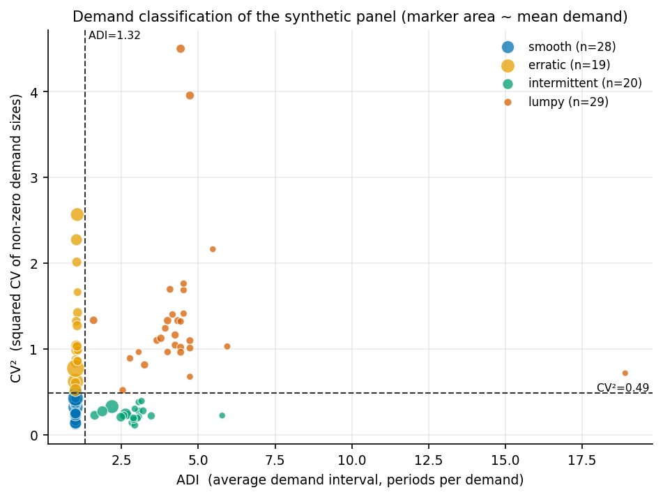
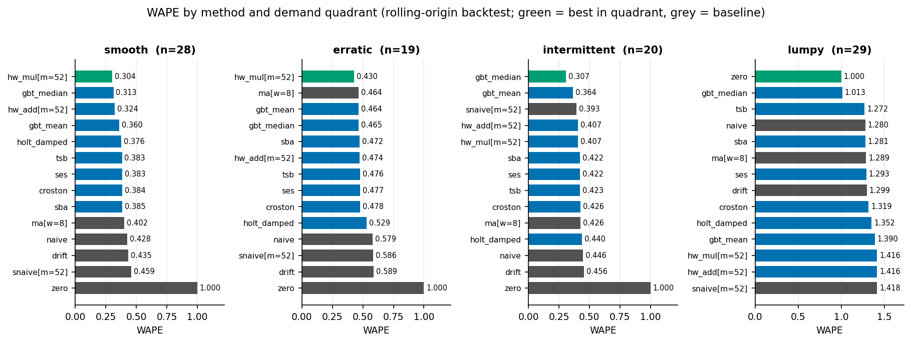
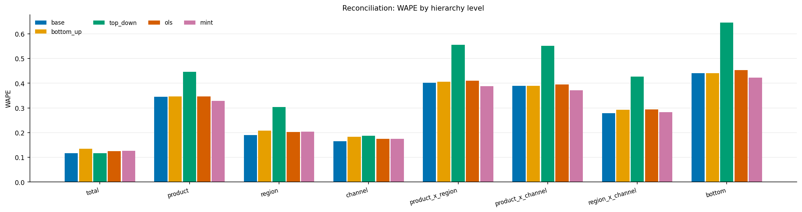

# demand-forecast-lab

**Benchmarking harness for intermittent and hierarchical demand forecasting.**

[](LICENSE)
[](pyproject.toml)
[](.github/workflows/ci.yml)

Classical and machine-learning forecasters implemented from the published
recursions, evaluated with rolling-origin backtesting, and reported **per
demand quadrant** — because the answer to "which method is best" is never one
method.

How this was built, and what it demonstrates against the AI Engineering skills
map: [`AI-ENGINEERING.md`](AI-ENGINEERING.md).

---

## Why this exists

Most forecasting comparisons report a single average accuracy number over an
assortment. That number is close to meaningless, because an assortment is a
mixture: a head of fast, seasonal, promo-driven items where the whole game is
getting the seasonal profile and the promo lift right, and a long tail of
slow movers where the only real question is whether demand happens at all.
Average them together and you get a champion model that is mediocre on both.

The failure mode this repository is built around is more specific than that.
Somebody benchmarks a new engine, it wins on average, it goes live, and six
months later service levels are down on the tail and nobody can explain why —
because the win came from the head, the tail quietly got worse, and the
reporting metric (usually MAPE, computed only on non-zero periods) could not
see it. Meanwhile the number in the S&OP deck does not match the sum of the
numbers in the replenishment system, and the meeting is about that instead of
about the plan.

So this harness does three things a normal benchmark does not: it splits every
result by Syntetos-Boylan-Croston demand quadrant, it uses metrics that are
defined when demand is zero, and it forces the multi-level plan to add up.

---

## What's implemented

**Baselines that must be beaten**
- Naive, seasonal naive, moving average, drift, historical mean, and a
  deliberate `zero` forecaster — Hyndman & Athanasopoulos, *Forecasting:
  Principles and Practice* (3rd ed., ch. 5).

**Exponential smoothing** — state-space recursions written out in numpy,
parameters fitted by box-constrained `scipy.optimize.minimize` with multi-start
- Simple exponential smoothing, ETS(A,N,N)
- Holt's linear trend, damped by default — Holt (1957/2004); Gardner &
  McKenzie (1985)
- Holt-Winters additive and multiplicative seasonality — Winters (1960);
  Hyndman, Koehler, Ord & Snyder (2008)

**Intermittent demand**
- Croston — Croston (1972), *Operational Research Quarterly* 23(3)
- Syntetos-Boylan Approximation — Syntetos & Boylan (2005), *IJF* 21(2)
- TSB — Teunter, Syntetos & Babai (2011), *EJOR* 214(3)

**Feature-based machine learning**
- Global cross-learning direct forecaster on
  `sklearn.ensemble.HistGradientBoostingRegressor`, trained in both
  absolute-error and squared-error variants
- ~30 engineered features: lags, causal rolling statistics, zero-run length,
  running ADI/CV², promotion flags at origin and target, aligned seasonal lag,
  calendar harmonics, categorical hierarchy coordinates
- Leakage-safe by construction and asserted by test — Januschowski et al.
  (2022), "Forecasting with trees"

**Hierarchical reconciliation** over a product × region × channel grouped
structure (180 nodes over 96 bottom cells)
- Bottom-up, top-down by historical proportions
- OLS reconciliation — Hyndman, Ahmed, Athanasopoulos & Shang (2011)
- MinT with Schäfer-Strimmer shrunk covariance — Wickramasuriya,
  Athanasopoulos & Hyndman (2019); Schäfer & Strimmer (2005)

**Evaluation**
- Rolling-origin backtesting with configurable horizon, step and window count —
  Tashman (2000)
- WAPE, MASE, sMAPE, RMSSE, bias, percent bias, tracking signal, pinball loss,
  empirical coverage, Forecast Value Add
- Demand classification into smooth / erratic / intermittent / lumpy from ADI
  and CV² — Syntetos, Boylan & Croston (2005)

**Synthetic data generator** — multi-level hierarchy, trend, multiplicative
seasonality with per-region phase shift, promotion calendar with lift and
post-promo dip, Bernoulli intermittency, new-product ramps, discontinuation
decay. Seeded and reproducible.

---

## Quickstart

```bash
git clone https://github.com/echosumeet/demand-forecast-lab
cd demand-forecast-lab
python -m pip install -e .

make test                                   # 110 tests, ~10s
python examples/01_quickstart.py            # generate, classify, forecast
python -m dflab classify                    # demand mix of the panel
python -m dflab backtest --windows 2        # the benchmark, short version
```

Regenerate every number and figure in this README:

```bash
python benchmarks/run_benchmarks.py         # ~5 min, writes benchmarks/results.md
```

Library use:

```python
from dflab import generate_panel, run_backtest

panel = generate_panel()                    # 96 series x 260 weeks, seeded
result = run_backtest(panel, horizon=13, step=13, n_windows=4)

print(result.overall()["sba"]["wape"])
print(result.best_by_quadrant())
print(result.value_add(baseline="snaive[m=52]"))
```

---

## Results

All numbers below are from a real run of `benchmarks/run_benchmarks.py` on this
repository; the full output is committed at
[`benchmarks/results.md`](benchmarks/results.md).

### The data

96 bottom series (8 products × 4 regions × 3 channels) over 260 weekly periods,
6,626,863 total units, 36.4% of cells zero, rolled up into 180 hierarchy nodes.
Data-generating process, seed `20260815`:

- multiplicative product-family seasonality, amplitude 0.28, with a
  region-specific phase shift — so aggregate seasonality is *not* the
  bottom-level shape scaled up
- per-item trend, centred slightly negative
- promotions on ~9% of weeks, lift up to 1.9×, 20% post-promotion dip
- Bernoulli intermittency with archetype-specific demand probability and gamma
  size dispersion
- 12% of items introduced mid-history with a ramp, 10% discontinued with a
  decay to zero
- integer demand

Classified on the training window only (first 208 periods, before the first
forecast origin):

| quadrant | series | mean ADI | mean CV² | zero weeks | share of volume |
|---|---|---|---|---|---|
| smooth | 28 | 1.00 | 0.28 | 0.0% | 52.4% |
| erratic | 19 | 1.03 | 1.19 | 3.3% | 37.0% |
| intermittent | 20 | 2.92 | 0.24 | 63.6% | 8.5% |
| lumpy | 29 | 4.63 | 1.39 | 74.8% | 2.0% |



That volume column is the reason per-quadrant reporting matters: **49 of the 96
series — the intermittent and lumpy tail — carry 10.5% of the volume.** Any
pooled metric is overwhelmingly a report on the head.

### Backtest

Rolling origin, horizon 13 weeks, step 13, 4 windows, cut-offs at 208 / 221 /
234 / 247, minimum training length 156 periods. Every model is re-fitted at
every cut-off. MASE denominators and quadrant labels are recomputed from the
training window each time.

**WAPE by method and demand quadrant** — the table this repository exists to
produce:

| method | smooth (n=28) | erratic (n=19) | intermittent (n=20) | lumpy (n=29) | **pooled** |
|---|---|---|---|---|---|
| gbt_median | 0.3134 | 0.4646 | **0.3070** | **1.0129** | **0.3976** |
| hw_mul[m=52] | **0.3044** | **0.4296** | 0.4072 | 1.4164 | 0.3994 |
| hw_add[m=52] | 0.3239 | 0.4742 | 0.4072 | 1.4164 | 0.4276 |
| gbt_mean | 0.3595 | 0.4645 | 0.3639 | 1.3903 | 0.4315 |
| sba | 0.3851 | 0.4717 | 0.4216 | 1.2811 | 0.4495 |
| tsb | 0.3827 | 0.4762 | 0.4228 | 1.2721 | 0.4505 |
| ses | 0.3834 | 0.4767 | 0.4222 | 1.2926 | 0.4514 |
| croston | 0.3837 | 0.4776 | 0.4261 | 1.3190 | 0.4530 |
| ma[w=8] | 0.4017 | 0.4639 | 0.4265 | 1.2887 | 0.4533 |
| holt_damped | 0.3762 | 0.5292 | 0.4396 | 1.3520 | 0.4760 |
| naive | 0.4277 | 0.5794 | 0.4460 | 1.2802 | 0.5186 |
| drift | 0.4355 | 0.5894 | 0.4563 | 1.2993 | 0.5280 |
| snaive[m=52] | 0.4586 | 0.5856 | 0.3926 | 1.4175 | 0.5304 |
| zero | 1.0000 | 1.0000 | 1.0000 | 1.0000 | 1.0000 |

**MASE by method and demand quadrant** (seasonal naive denominator, m=52):

| method | smooth | erratic | intermittent | lumpy | pooled |
|---|---|---|---|---|---|
| gbt_median | **0.931** | **0.902** | **0.701** | 0.749 | **0.822** |
| hw_mul[m=52] | 0.995 | 1.015 | 0.890 | 1.178 | 1.032 |
| sba | 1.273 | 0.972 | 0.849 | 1.040 | 1.055 |
| ma[w=8] | 1.315 | 0.976 | 0.825 | 1.017 | 1.056 |
| hw_add[m=52] | 1.059 | 1.100 | 0.890 | 1.178 | 1.068 |
| tsb | 1.319 | 0.992 | 0.838 | 1.039 | 1.070 |
| ses | 1.322 | 0.996 | 0.831 | 1.044 | 1.071 |
| croston | 1.321 | 0.999 | 0.878 | 1.084 | 1.093 |
| holt_damped | 1.314 | 1.051 | 0.853 | 1.083 | 1.096 |
| snaive[m=52] | 1.380 | 1.285 | 0.981 | 1.229 | 1.232 |
| naive | 1.642 | 1.281 | 0.868 | 1.145 | 1.259 |
| gbt_mean | 1.021 | 0.985 | 0.968 | 1.886 | 1.264 |
| drift | 1.677 | 1.316 | 0.888 | 1.171 | 1.288 |
| zero | 3.288 | 1.654 | 1.150 | **0.762** | 1.756 |

MASE and WAPE do not agree, and the disagreement is informative rather than a
problem. MASE normalises each series by its own seasonal-naive scale before
averaging, so it treats every SKU equally; WAPE is volume-weighted. `ma[w=8]`
looks respectable on MASE (1.056) and mediocre on WAPE (0.4533) because it does
well on the many small series and poorly on the few large ones. Report both, or
be explicit about which population you are optimising for.



### The headline findings

**1. There is no champion — there is a routing rule.**

| quadrant | best method | WAPE | seasonal naive | FVA |
|---|---|---|---|---|
| smooth | `hw_mul[m=52]` | 0.3044 | 0.4586 | +33.6% |
| erratic | `hw_mul[m=52]` | 0.4296 | 0.5856 | +26.6% |
| intermittent | `gbt_median` | 0.3070 | 0.3926 | +21.8% |
| lumpy | `zero` | 1.0000 | 1.4175 | +29.5% |

**2. On lumpy demand, nothing beats forecasting zero.** Every real method
scores above WAPE 1.0 there; the best (`gbt_median`) reaches 1.0129. This is
not a bug — with 75% zero weeks the absolute-error-minimising constant forecast
*is* zero. The conclusion is not "forecast zero", it is that point accuracy is
the wrong objective for that quadrant and the tail should be managed on service
level, not on WAPE.

**3. Twenty-five percent value add, total, against four lines of numpy.** The
best method overall (`gbt_median`, WAPE 0.3976) beats seasonal naive (0.5304) by
FVA **0.250**. That is a genuine result and also a calibration on expectations:
optimised ETS, three intermittent estimators and a 30-feature gradient boosted
global model together buy a quarter of the error.

**4. The training loss decides whether your forecast is biased.**
`gbt_median` (absolute-error loss, fits the conditional median) wins WAPE but
carries **−14.7% bias** — it under-forecasts total volume by nearly a sixth.
`gbt_mean` (squared error, fits the mean) is nearly unbiased at −2.3% and loses
on WAPE. Feed a median forecast into a safety-stock formula that assumes an
unbiased mean and you have built a structural shortfall no amount of safety
stock tuning will repair.

**5. 65% of the assortment cannot use a multiplicative seasonal model at all.**
62 of 96 series contain a zero week in the first training window. The
implementation detects this and falls back to additive with a `degenerate_`
flag, which is why `hw_mul` and `hw_add` post identical numbers on the
intermittent and lumpy quadrants. Before that guard existed, `hw_mul` scored
WAPE **365** on the intermittent quadrant.

### Quantile forecasts

Three independent `HistGradientBoostingRegressor(loss="quantile")` fits:

| quantile | pinball loss | empirical coverage |
|---|---|---|
| 0.5 | 94.713 | 0.653 |
| 0.9 | 71.713 | 0.894 |
| 0.95 | 61.249 | 0.930 |

The upper quantiles land close to nominal, which is what a safety-stock input
needs. The q50 row over-covers at 0.653 because 36% of cells are zero and every
zero actual counts as covered by any non-negative forecast — a distribution
with an atom at zero does not obey continuous-quantile intuitions.

### Hierarchical reconciliation

Base forecasts produced independently at each of the 180 nodes (Holt-Winters
additive where two full seasonal cycles of dense history exist, SES or SBA
otherwise), then reconciled. WAPE by level, pooled over 2 windows of horizon 13.
Fitted Schäfer-Strimmer shrinkage intensity: **0.428**.

| method | total | product | region | channel | prod×reg | prod×chan | reg×chan | bottom | max coherency error |
|---|---|---|---|---|---|---|---|---|---|
| base (incoherent) | **0.1175** | 0.3455 | **0.1902** | **0.1656** | 0.4025 | 0.3893 | **0.2785** | 0.4399 | 5.99e+03 |
| bottom_up | 0.1347 | 0.3460 | 0.2081 | 0.1835 | 0.4066 | 0.3900 | 0.2924 | 0.4399 | 0 |
| top_down | 0.1175 | 0.4456 | 0.3036 | 0.1880 | 0.5561 | 0.5512 | 0.4260 | 0.6453 | 0 |
| ols | 0.1257 | 0.3466 | 0.2025 | 0.1746 | 0.4107 | 0.3943 | 0.2940 | 0.4530 | 0 |
| **mint** | 0.1268 | **0.3280** | 0.2038 | 0.1751 | **0.3880** | **0.3708** | 0.2833 | **0.4229** | 0 |



**MinT wins five of the eight levels among the reconciliation methods**,
including the bottom (0.4229 vs 0.4399 base, a 3.9% improvement *while* making
the plan add up exactly). Bottom-up costs 1.7 points of WAPE at the total —
coherency is not free, and anyone who says bottom-up is obviously right has not
measured the top. Top-down is worst at the bottom by a wide margin because
historical proportions carry no information about which cell is currently
growing.

---

## Design notes

Full discussion in [`docs/design.md`](docs/design.md). The condensed version:

### Why WAPE dominates MAPE with intermittent series

MAPE is undefined on a zero actual, and 36% of the cells in this panel are
zero (75% in the lumpy quadrant). Every MAPE implementation therefore either
drops those periods — silently evaluating on a biased subsample of exactly the
periods the model found easy — or floors the denominator, inventing an error
scale. It is also asymmetric in the direction that matters: the penalty for
forecasting 0 against an actual of 10 is capped at 100%, while forecasting 10
against an actual of 1 costs 900%. A planner optimising reported MAPE learns to
forecast low, and the accuracy dashboard shows a service-level problem as an
improvement.

WAPE (`sum|error| / sum|actual|`) is defined whenever the window contains any
demand, is volume-weighted by construction, and carries a free interpretation:
**a zero forecast scores exactly 1.0**, so anything above 1.0 is worse than
giving up. That is asserted as a test, and it is why `zero` is in the model zoo.

Pooling matters as much as the metric. Every aggregate here sums numerators and
denominators rather than averaging per-series ratios — otherwise the 2%-of-
volume lumpy tail outvotes the 52%-of-volume head.

### Why MASE needs a seasonal naive denominator

With a naive-1 denominator, a seasonal series makes the denominator large
(consecutive periods differ by the whole seasonal swing), so any model that
merely reproduces seasonality scores well below 1 and looks skilful while
adding nothing. A seasonal denominator (`mean|y_t − y_{t−m}|`) asks the
question that matters: did this beat the free seasonal forecast? Note that
seasonal naive itself scores MASE 1.232 out of sample — the in-sample
denominator is estimated on a longer, quieter stretch of history than the test
window. MASE is a ranking device, not an absolute grade.

Denominators are recomputed per rolling window from the training portion.
Computing them once on the full series leaks test-period volatility into the
scale and changes the ranking.

### Forecast value add against the naive baseline

Every result carries FVA against `snaive[m=52]`, because the question a planning
organisation actually has is not "how accurate is the model" but "is this worth
the maintenance". Three of the four quadrant winners deliver 22-34% FVA, which
is worth building. The fourth is `zero`, which is a diagnostic, not a
deliverable.

The zoo deliberately includes methods that should lose. When `naive` wins a
quadrant, that is information — it usually means a structural break the
seasonal model is fighting.

### The reconciliation coherency requirement

Finance consumes the total, category management consumes product, the network
consumes region, replenishment consumes the bottom cell. Produced
independently those numbers miss by about 6,000 units at the worst node here (5.99e+03), and the
S&OP meeting becomes an argument about whose number is wrong instead of a
decision.

Every method implemented takes the form `ỹ = S G ŷ`, and every `G` satisfies
`S G S = S` — so coherency is structural, and feeding in an already-coherent
set returns it unchanged (asserted directly in the tests). The interesting part
is that coherency has a price which is not uniform across levels, and MinT is
the method that estimates the error covariance rather than assuming it. With
180 nodes and 104 usable residuals the sample covariance is rank-deficient by
construction; the Schäfer-Strimmer shrinkage (fitted intensity 0.428) is what
makes the inverse meaningful, with no tuning parameter to defend.

One deliberate departure from the papers: reconciled bottom-level forecasts are
clipped at zero and re-aggregated. Unconstrained MinT will hand replenishment a
negative cell, and a negative demand plan is worse than an incoherent one.

### What I would actually watch in production

Not WAPE. WAPE is the diagnostic. The monitored numbers would be **percent
bias** by quadrant (drift toward under-forecast is the early warning of a
service problem), **tracking signal** with a limit scaled to the review window
— the folklore ±4 threshold has a false-alarm rate above a third on a 13-week
window, which is why nobody reads that exception report — and **FVA against the
incumbent**, monthly, so a model that has stopped earning its keep gets
retired instead of accumulating special cases.

---

## Limitations & what I'd do next

**Synthetic data is a friendly world.** The generator produces trend,
multiplicative seasonality, promotions and intermittency — structures that the
methods being benchmarked are designed to capture. Real demand has regime
changes, cannibalisation, supply-constrained periods that censor demand, and
data quality problems that look like signal. The relative ranking here is
informative; the absolute WAPEs are optimistic.

**Censoring is not modelled at all.** Every zero in this panel is a genuine
zero-demand period. In reality a large share of observed zeros are stockouts,
and a forecast fitted to censored history systematically under-forecasts the
items that need the most stock. Adding a stockout mask and a censored-demand
estimator is the single highest-value extension.

**One seed, four windows, no significance testing.** The quadrant rankings
should be read as directional. Repeating over seeds and reporting a
Diebold-Mariano or a simple win-rate across series would make the differences
defensible; right now a 0.01 WAPE gap is not evidence of anything.

**The lumpy quadrant is evaluated on the wrong objective**, and the repository
says so rather than hiding it. The right evaluation is a periodic-review
inventory simulation: feed each method's forecast into an (R, s, S) policy and
compare fill rate at matched holding cost. That converts "WAPE 1.27 vs 1.28"
into "3 points of fill rate at the same inventory", which is a decision.

**No intermittent-specific quantiles.** The quantile models are the same
gradient boosting stack. For a spare part, the right predictive distribution is
compound — Bernoulli occurrence times a size distribution — and a bootstrapped
lead-time demand distribution would beat a quantile-regression tree that has to
learn the atom at zero from data.

**Reconciliation is evaluated on point accuracy only.** Probabilistic
reconciliation (Panagiotelis et al., 2023) is where the field has moved, and
coherent quantiles are what an inventory policy actually needs.

**No cost side.** Accuracy is an input to a decision, never the decision.
Everything here would be more useful expressed as expected holding plus
shortage cost under a stated service target.

---

## References

- Brown, R.G. (1959). *Statistical Forecasting for Inventory Control*.
  McGraw-Hill.
- Croston, J.D. (1972). "Forecasting and stock control for intermittent
  demands." *Operational Research Quarterly* 23(3), 289-303.
- Gardner, E.S. & McKenzie, E. (1985). "Forecasting trends in time series."
  *Management Science* 31(10), 1237-1246.
- Gilliland, M. (2010). *The Business Forecasting Deal*. Wiley.
- Gneiting, T. & Raftery, A.E. (2007). "Strictly proper scoring rules,
  prediction, and estimation." *Journal of the American Statistical
  Association* 102(477), 359-378.
- Holt, C.C. (1957/2004). "Forecasting seasonals and trends by exponentially
  weighted moving averages." *International Journal of Forecasting* 20(1),
  5-10.
- Hyndman, R.J. & Koehler, A.B. (2006). "Another look at measures of forecast
  accuracy." *International Journal of Forecasting* 22(4), 679-688.
- Hyndman, R.J., Koehler, A.B., Ord, J.K. & Snyder, R.D. (2008). *Forecasting
  with Exponential Smoothing: The State Space Approach*. Springer.
- Hyndman, R.J., Ahmed, R.A., Athanasopoulos, G. & Shang, H.L. (2011). "Optimal
  combination forecasts for hierarchical time series." *Computational
  Statistics & Data Analysis* 55(9), 2579-2589.
- Hyndman, R.J. & Athanasopoulos, G. (2021). *Forecasting: Principles and
  Practice*, 3rd ed. OTexts.
- Januschowski, T., Wang, Y., Torkkola, K., Erkkilä, T., Hasson, H. &
  Gasthaus, J. (2022). "Forecasting with trees." *International Journal of
  Forecasting* 38(4), 1473-1481.
- Kolassa, S. & Schütz, W. (2007). "Advantages of the MAD/Mean ratio over the
  MAPE." *Foresight* 6, 40-43.
- Makridakis, S., Spiliotis, E. & Assimakopoulos, V. (2022). "M5 accuracy
  competition: results, findings and conclusions." *International Journal of
  Forecasting* 38(4), 1346-1364.
- Panagiotelis, A., Gamakumara, P., Athanasopoulos, G. & Hyndman, R.J. (2023).
  "Probabilistic forecast reconciliation: properties, evaluation and score
  optimisation." *European Journal of Operational Research* 306(2), 693-706.
- Schäfer, J. & Strimmer, K. (2005). "A shrinkage approach to large-scale
  covariance matrix estimation and implications for functional genomics."
  *Statistical Applications in Genetics and Molecular Biology* 4(1).
- Silver, E.A., Pyke, D.F. & Thomas, D.J. (2016). *Inventory and Production
  Management in Supply Chains*, 4th ed. CRC Press.
- Syntetos, A.A. & Boylan, J.E. (2005). "The accuracy of intermittent demand
  estimates." *International Journal of Forecasting* 21(2), 303-314.
- Syntetos, A.A., Boylan, J.E. & Croston, J.D. (2005). "On the categorization
  of demand patterns." *Journal of the Operational Research Society* 56(5),
  495-503.
- Tashman, L.J. (2000). "Out-of-sample tests of forecasting accuracy: an
  analysis and review." *International Journal of Forecasting* 16(4), 437-450.
- Teunter, R.H., Syntetos, A.A. & Babai, M.Z. (2011). "Intermittent demand:
  Linking forecasting to inventory obsolescence." *European Journal of
  Operational Research* 214(3), 606-615.
- Wickramasuriya, S.L., Athanasopoulos, G. & Hyndman, R.J. (2019). "Optimal
  forecast reconciliation for hierarchical and grouped time series through
  trace minimization." *Journal of the American Statistical Association*
  114(526), 804-819.
- Winters, P.R. (1960). "Forecasting sales by exponentially weighted moving
  averages." *Management Science* 6(3), 324-342.

---

## License

MIT. Copyright (c) 2026 Sumeet.

All data in this repository is generated by `dflab.datagen`. Nothing here is
derived from any employer's systems, data or processes, and none of this code
has been used in production anywhere.
