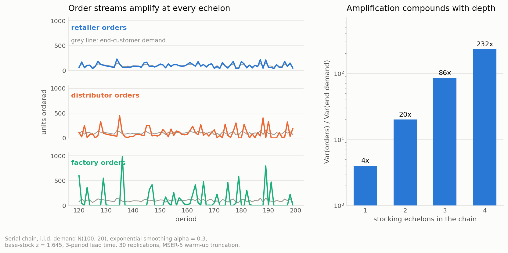
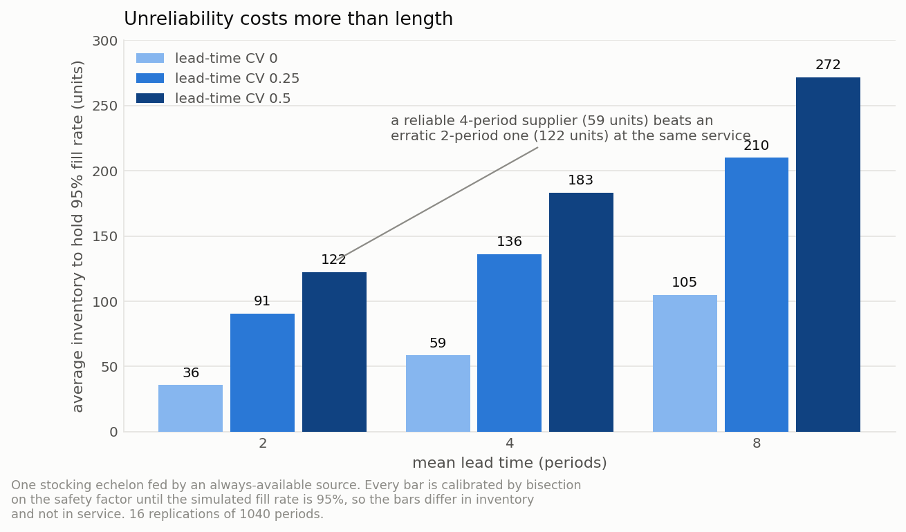
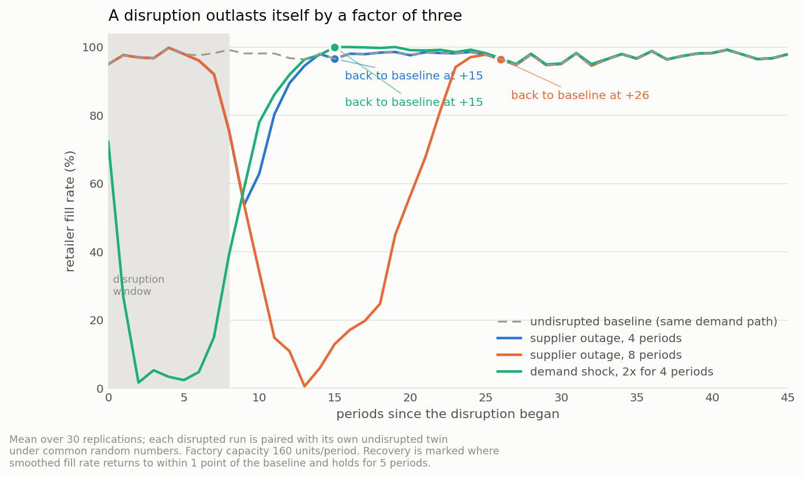
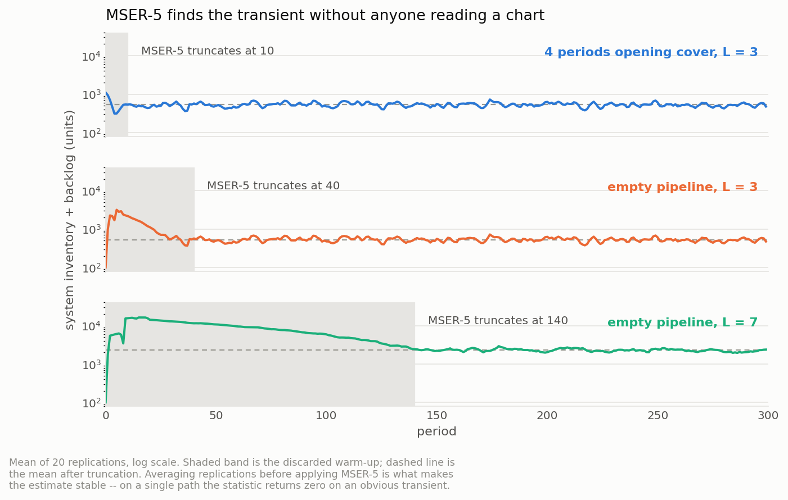

# echelon-sim

Discrete-event simulation of multi-echelon supply chains, with bullwhip measurement — on a hand-rolled `heapq` event engine, because the period structure is the model.

[](LICENSE)
[](https://www.python.org/)
[](.github/workflows/ci.yml)

## Why this exists

Every echelon in this simulated chain behaves reasonably. Each one forecasts with
a standard exponential smoother, runs a standard order-up-to policy, and roughly
**quadruples** the variance it was handed — a local amplification of 4.0, 5.0 and
4.3 at the retailer, distributor and factory. Nobody is panicking, nobody is
gaming anyone, and every one of those numbers would pass a review.

The factory still sees an order stream with **85.8 times** the variance of the
consumer demand that caused it, because modest factors multiply. That is the
failure mode: the amplification is invisible from inside any single node, and the
people who can see it — the ones staring at the factory schedule — are the ones
with the least ability to do anything about it.

The second failure mode is temporal. A supplier outage of 8 periods takes **26
periods** to recover from, and the fill-rate trough arrives **13 periods after
the outage begins** — by which time the supplier has been back for five periods
and the incident review is looking at the wrong week.

This package exists to put numbers on both, with the output analysis done
properly: common random numbers, estimated warm-up truncation, batch-means
intervals, and validation against closed-form results the simulator has no
knowledge of.

How this repository was built, and how it maps to the AI Engineering skills map:
[`AI-ENGINEERING.md`](AI-ENGINEERING.md).

## What's implemented

**Simulation engine** (`engine.py`, ~330 lines, no simulation dependency)

- `heapq` event loop keyed on `(time, priority, insertion counter)` — a total
  order, so runs are byte-identical across machines. That is the precondition
  for common random numbers.
- Generator-based processes, `Timeout`, process-waits-on-process, and
  `Interrupt` — a supply disruption is naturally something that happens *to* a
  node mid-cycle, not a flag its normal path has to check.
- Explicit priority bands, so the seven phases of a simulated period are a table
  in the source rather than an emergent property of a framework.

**Multi-echelon network** (`network.py`, `simulation.py`)

- Retailers, distributors, factory, external source; serial and divergent
  topologies. Inventory position, in-transit pipeline, FIFO backorder queues,
  per-period throughput capacity.
- **Clark & Scarf (1960) echelon inventory position**, with the pipeline split
  into `on_order` and `in_transit` because only the second is physically real
  inside an echelon (see `docs/design.md`, decision 3).
- Real-valued stochastic transit times with order crossing permitted, and a
  no-crossing wrapper for modes where it cannot physically happen.
- Allocation rules: FIFO and proportional (the rule that creates Lee,
  Padmanabhan & Whang's rationing game).

**Policies and forecasting**

- Base-stock, `(s,S)`, `(R,S)`, and order batching as a composable decorator
  (round-up multiple and minimum order quantity), so batching can be ablated
  independently of the policy shape (Silver, Pyke & Thomas 2016, Ch. 6–8).
- Moving average, single exponential smoothing with smoothed MAD, damped-trend
  Holt (Gardner & McKenzie 1985), and an oracle forecaster used as the ablation
  control.
- Protection interval `R + L - 1`, derived from this package's own phase
  ordering rather than copied — see Design notes below.

**Experiment framework** (`experiments.py`, `metrics.py`)

- Plain-dict / JSON configs, deep-merged over a documented default.
- **Common random numbers** via named independent streams: replication *i* of
  every scenario sees the identical demand path, so the comparisons are paired.
- **MSER-5 warm-up truncation** (White 1997; Franklin & White 2008) on
  replication-averaged paths, plus Welch's moving average for the plot.
- **Batch-means confidence intervals** (Schmeiser 1982) that report the lag-1
  correlation of the batch means alongside the interval.
- Paired-t intervals for scenario differences; log-scale intervals for variance
  ratios.

**Experiments** (`bullwhip.py`, `information.py`, `tradeoffs.py`, `disruption.py`)

- Amplification by echelon, local and cumulative, with intervals.
- **Shapley decomposition** over the full `2^3` factorial of demand signal
  processing, order batching and lead time (Lee, Padmanabhan & Whang 1997).
- Decentralised vs shared point-of-sale vs vendor-managed inventory, calibrated
  to equal service (Cachon & Fisher 2000; Disney & Towill 2003; Chen 1998).
- Lead-time length vs lead-time variability at a fixed fill rate, against the
  convolution formula `sqrt(L·σ_d² + d̄²·σ_L²)` (Eppen & Martin 1988).
- Supplier outage, demand shock and capacity loss, with time-to-recover measured
  against a paired undisrupted twin.

## Quickstart

```bash
git clone https://github.com/echosumeet/echelon-sim
cd echelon-sim
python -m pip install -e ".[figures]"

python -m unittest discover -s tests -v      # 143 tests
python -m echelonsim bullwhip                # amplification by echelon
python -m echelonsim decompose               # Shapley attribution
python -m echelonsim information --target-fill 0.975
python -m echelonsim disrupt --duration 8
python examples/05_engine_tour.py            # the engine, without the model

# an experiment is a JSON document, deep-merged over the documented default
python -m echelonsim --config examples/experiment_config.json run
```

In code:

```python
from echelonsim import IIDNormal, serial_chain, run_simulation

chain = serial_chain(levels=3)                      # retailer -> distributor -> factory -> source
result = run_simulation(chain, IIDNormal(100, 20), periods=720, seed=1).trim(50)

result.cumulative_bullwhip()   # {'retailer': 1.8, 'distributor': 4.1, 'factory': 9.9}
result.fill_rates()            # {'retailer': 0.968, 'distributor': 0.947, 'factory': 0.937}
result.average_cost()          # 398.4  (holding + backorder per period)
```

Everything above runs with `numpy` and `scipy` only. `matplotlib` is needed just
to regenerate the figures.

## Results

All numbers below come from `benchmarks/run_benchmarks.py` and are copied from
[`benchmarks/results.md`](benchmarks/results.md). Nothing is typed by hand.

**Data-generating process.** There is no dataset. Customer demand is i.i.d.
`N(100, 20)` per period, truncated at zero. The chain is retailer → distributor →
factory → external source; every arc has a 1-period order (information) lead time
plus 2 periods of transit, so `L = 3`. Every node forecasts with exponential
smoothing `α = 0.3` and runs a base-stock policy with `z = 1.645`, reviewing every
period. 30 replications of 720 periods, seed 20260215, warm-up truncated by
MSER-5, 95% intervals.

### The simulator agrees with theory where theory exists

A single order-up-to stage with `z = 0` and signed orders has a closed-form
amplification. The full stack — engine, network, event loop — is run against it.

| configuration | simulated `Var(q)/Var(d)` | closed form | error |
|---|---|---|---|
| moving average, p=5 | 2.9160 | 2.9200 | −0.14% |
| moving average, p=10 | 1.7852 | 1.7800 | +0.29% |
| moving average, p=20 | 1.3445 | 1.3450 | −0.04% |
| exponential smoothing, α=0.1 | 1.6953 | 1.6947 | +0.03% |
| exponential smoothing, α=0.3 | 3.7643 | 3.7529 | +0.30% |
| exponential smoothing, α=0.5 | 7.0372 | 7.0000 | +0.53% |

The moving-average column is Theorem 1 of Chen, Drezner, Ryan & Simchi-Levi
(2000). The smoothing column is the analogue derived in `bullwhip.py` for this
package's timing convention, shown as a derivation rather than a citation.

### Bullwhip by echelon

| echelon | local `Var(orders)/Var(own demand)` | cumulative `Var(orders)/Var(end demand)` |
|---|---|---|
| retailer | 3.99 ± 0.03 | 3.99 ± 0.03 |
| distributor | 5.01 ± 0.03 | 20.01 ± 0.25 |
| factory | 4.29 ± 0.07 | **85.84 ± 1.87** |

Add a fourth echelon and the top of the chain reaches **231.70 ± 8.27**. The
local factors barely change; the compounding does all the work.



Amplification also rises with forecast responsiveness, exactly as the closed form
predicts: retailer amplification goes 1.53 → 1.91 → 2.82 → 3.99 → 7.20 → 13.87
as `α` goes 0.05 → 0.1 → 0.2 → 0.3 → 0.5 → 0.8.

### Where the amplification comes from

Full `2^3` factorial, common random numbers across all eight cells, Shapley value
on `log(amplification)` computed per replication. Metric is
`Var(factory orders)/Var(end demand)`.

| mechanism | Shapley value (log) | multiplicative effect | share |
|---|---|---|---|
| demand signal processing | +2.777 ± 0.020 | ×16.07 | 47.0% |
| order batching | +2.687 ± 0.020 | ×14.68 | 45.5% |
| lead time | +0.446 ± 0.010 | ×1.56 | 7.5% |

All mechanisms off: **1.000** — theory says exactly 1.0, and it is a good check
that it lands there. All on: **368.4**.

The cell table is the interesting part:

| mechanisms active | amplification |
|---|---|
| (none) | 1.00 |
| lead time alone | **1.00** |
| signal alone | 36.96 |
| batching alone | 77.15 |
| signal + lead time | 192.82 |
| batching + lead time | 77.10 |
| signal + batching | 220.90 |
| all three | 368.44 |

**A long lead time on its own amplifies nothing.** With a known mean and no
batching, orders equal demand no matter how long the pipeline is. Its entire
Shapley contribution is interaction — it multiplies whatever the forecast is
already doing (36.96 → 192.82), and it does nothing at all to a batching-only
chain (77.15 → 77.10). Ablate one mechanism at a time and lead time scores zero,
which sends the reader off to fix the wrong thing.

### Information sharing, at equal service

Every mode's safety factor is bisected until the retailer fill rate is 97.5%, so
what differs between rows is inventory and order variance, not service.

| mode | calibrated z | factory amplification | fill rate | system inventory | cost/period |
|---|---|---|---|---|---|
| decentralised | 1.637 | 85.58 ± 1.88 | 97.48% | 513 | 671 |
| shared POS | 1.672 | **4.55 ± 0.07** | 97.57% | **191** | 400 |
| VMI (echelon stock) | 1.426 | 14.41 ± 0.14 | 97.50% | 297 | **385** |

Amplification by echelon, same runs:

| mode | retailer | distributor | factory |
|---|---|---|---|
| decentralised | 3.99 | 19.96 | 85.44 |
| shared POS | 4.00 | 4.32 | 4.55 |
| VMI | 3.93 | 8.64 | 14.41 |

Paired against decentralised (common random numbers, so these are paired-t):

| | factory amplification | system inventory | total cost |
|---|---|---|---|
| shared POS | **−94.7% ± 0.1** | **−62.8% ± 0.2** | −40.4% ± 0.8 |
| VMI | −83.1% ± 0.3 | −42.0% ± 0.6 | **−42.7% ± 0.5** |

Note that the two shared modes are not ranked the same way on every column, and
the reason is worth more than the headline. Sharing POS data removes the forecast
cascade and gives the largest variance reduction — but each node still runs its
own installation stock, and now sizes it from the dispersion of *end demand*
while actually facing the dispersion of the *order stream* above it, which is
four times larger. Upstream buffers end up thin. VMI leaves more variance at the
factory (its echelon target covers the cumulative lead time, so it responds
harder to a forecast revision) but puts the stock where the demand is, and comes
out cheapest.

### Lead-time length vs lead-time variability

One stocking echelon fed by an always-available source. Every cell calibrated by
bisection to a 95% fill rate before inventory is compared.

| mean lead time | lead-time CV | calibrated z | fill rate | average inventory | σ_DL (analytic) |
|---|---|---|---|---|---|
| 2 | 0.00 | 0.916 | 94.98% | 36 | 35 |
| 2 | 0.25 | 3.992 | 95.01% | 91 | 61 |
| 2 | 0.50 | 4.977 | 95.05% | 122 | 106 |
| 4 | 0.00 | 1.232 | 95.01% | 59 | 45 |
| 4 | 0.50 | 5.258 | 94.99% | 183 | 205 |
| 8 | 0.00 | 1.707 | 94.95% | 105 | 60 |
| 8 | 0.50 | 5.363 | 94.96% | 272 | 404 |

Doubling the mean lead time from 2 to 4 periods costs **+63.3%** inventory at
equal service. Adding a 0.5 coefficient of variation at the *original* 2-period
mean costs **+241.1%**. A perfectly reliable 4-period supplier (59 units) is
cheaper than an erratic 2-period one (122 units) — and so is a reliable
*8*-period supplier (105 units).



The calibrated `z` column is the finding as much as the inventory is. The policy
sizes its safety term from demand dispersion only, `z·σ̂·√(R+L−1)`, which is what
essentially every planning system does. Lead-time variance appears nowhere in
that expression, so `z` absorbs it, climbing from 0.92 to roughly 4 the moment
the supplier becomes unreliable. A `z` of 4 is not a service-level decision
anybody made; it is a parameter patching a missing term.

### Disruption and recovery

Factory capacitated at 160 units/period (1.6× mean demand). Each scenario is
compared against its own undisrupted twin under common random numbers — same
demand, same transit draws, only the disruption differs.

| scenario | length | fill-rate trough | trough at | periods to recover [95% CI] | recovery / length | units late |
|---|---|---|---|---|---|---|
| supplier outage, 2 periods | 2 | 92.0% | +7 | 11 [0, 11] | 5.5× | 11 |
| supplier outage, 4 periods | 4 | 53.7% | +9 | 15 [14, 16] | 3.8× | 137 |
| supplier outage, 8 periods | 8 | **0.6%** | +13 | **26** [25, 27] | 3.2× | 964 |
| demand shock, 2× for 4 periods | 4 | 1.6% | +2 | 15 [13, 16] | 3.8× | 663 |
| factory capacity −50%, 8 periods | 8 | 56.9% | +11 | 17 [16, 17] | 2.1× | 196 |



Three things a risk register usually gets wrong, all visible here.

**Recovery is 2–4× the disruption.** The backlog has to be worked off *on top of*
ongoing demand, through a chain that is simultaneously re-ordering against
depressed inventory positions everywhere.

**The trough lags the event.** The 8-period outage bottoms out 13 periods in, five
periods after the supplier is back. The service failure and its cause are not
contemporaneous, and the escalation arrives pointing at the wrong week.

**The response is sharply non-linear in duration.** Doubling a 4-period outage to
8 periods does not double the damage: the trough falls from 53.7% to 0.6% and
late units go from 137 to 964, a factor of seven. The chain has roughly four
periods of slack and then it has none.

## Design notes

Full version in [`docs/design.md`](docs/design.md). The four decisions that
mattered most:

**The protection interval is `R + L − 1`, not `R + L`.** The textbook expression
assumes the review happens before the period's demand is served. In this model
allocation runs at priority 30 and review at priority 50, so a node has already
shipped today's orders by the time it reviews and today's demand is not at risk.
Using `R + L` inflates every target by a full period of mean demand — 100 units
on a 100-unit item, 400 units of system inventory across four echelons, bought to
fix an arithmetic convention. The test that pins it asserts that an oracle
forecast with no batching places orders *exactly* equal to the demand just
served; any off-by-one in the phase ordering breaks that identity immediately.
This is the kind of defect that survives for years in production, because it
never raises and the numbers it produces look fine.

**Why CRN is not optional.** Without paired seeds, the difference between two
information modes is comfortably inside the noise at any replication count a
laptop will tolerate — the demand path dominates the variance, and it is a
nuisance parameter. With named per-element streams, replication *i* of "VMI" and
replication *i* of "decentralised" see identical demand and identical transit
draws, and the paired interval on the cost difference comes out at ±0.5
percentage points on 30 replications. The subtle part is *isolation*: streams are
keyed by `(seed, replication, name)` and nothing else, so adding a stochastic
element to one part of the model cannot shift the draws in another. A single
global generator gives you reproducibility but not pairing, and pairing is the
thing that buys the replications.

**Why warm-up truncation is not optional either, and why it is easy to skip.**
The default configuration here starts with four periods of cover and settles in
about 10 periods, so truncation changes the mean inventory by 0.1%. Start the
same chain cold and the bias is +7.7%; lengthen the lead time to 7 periods and it
is **+49.9%** over a 720-period run, with a transient that runs 140 periods.
Nothing in the configuration tells you which case you are in, and the biased
number is not obviously wrong — it is just 50% too high. MSER-5 is applied to the
*replication-averaged* path, because on a single run the statistic is noisy
enough to return zero on a series with an obvious transient.



**Why the naive confidence interval is wrong rather than merely optimistic.**
Consecutive periods of an inventory series are strongly dependent. On one 660-period
run the naive i.i.d. half-width on mean system inventory is ±22.7 units; batch
means with 20 batches gives ±34.6, **1.5× wider** — and on smoother series the
factor is much larger. There are nowhere near 660 independent observations in
that data. Every "significant" improvement computed the naive way inherits the
same factor, which is how a simulation study ends up recommending a change worth
nothing.

Two smaller ones worth the paragraph:

**Shapley, not sequential ablation.** The three bullwhip mechanisms do not
commute, so "turn one off and subtract" gives an answer that depends on the order
you turned them off in. The `2^3` factorial with Shapley attribution on log
amplification is the unique decomposition that is efficient, symmetric and
ablation-order independent — and it is the only reason lead time gets any credit
at all, since its standalone effect is exactly 1.00.

**Variance, not coefficient of variation.** The CV ratio is the more common
dashboard metric and it confounds amplification with a change in mean throughput
— which is precisely what happens during a recovery, when the mean order rate
rises while backlog is worked off. It makes a recovering chain look calmer than
it is.

## Limitations & what I'd do next

- **Backorders only.** Every unfilled order waits. Lost sales change the
  fill-rate definition, the recovery metric and the optimal policy shape, and the
  real answer for most consumer goods is somewhere between the two.
- **No node exploits the allocation rule.** Proportional allocation is
  implemented and creates the incentive to inflate orders, but every policy here
  orders its true requirement. Three of Lee, Padmanabhan & Whang's four causes
  are measurable in this package; the rationing game is not. Adding a strategic
  orderer is the single most interesting extension.
- **Capacity is enforced but never anticipated.** A capacitated node ships no
  more than its capacity, and no policy knows its own capacity — realistic, and
  also a limitation. The capacity-loss recovery numbers would improve
  substantially with a capacity-aware policy, and quantifying by how much is a
  well-posed question this code could answer.
- **Single sourcing, one product, stationary demand.** Dual sourcing is the most
  common real resilience lever and is not modelled. Neither is shared constrained
  capacity across a portfolio, which is where a lot of real amplification
  actually originates.
- **The information-sharing comparison holds topology fixed.** The most valuable
  real intervention is usually removing an echelon, not instrumenting one, and
  this design cannot express "the distributor stops holding stock" as a mode.
- **Fixed replication count.** A sequential stopping rule — run until the
  relative half-width of the target metric is under a threshold — would spend the
  compute where the variance actually is. Right now the lead-time grid burns most
  of the runtime on cells that converged five iterations ago.

## References

- Clark, A. J. & Scarf, H. (1960). Optimal policies for a multi-echelon inventory
  problem. *Management Science* 6(4), 475–490.
- Lee, H. L., Padmanabhan, V. & Whang, S. (1997). Information distortion in a
  supply chain: the bullwhip effect. *Management Science* 43(4), 546–558.
- Chen, F., Drezner, Z., Ryan, J. K. & Simchi-Levi, D. (2000). Quantifying the
  bullwhip effect in a simple supply chain. *Management Science* 46(3), 436–443.
- Chen, F., Ryan, J. K. & Simchi-Levi, D. (2000). The impact of exponential
  smoothing forecasts on the bullwhip effect. *Naval Research Logistics* 47(4),
  269–286.
- Chen, F. (1998). Echelon reorder points, installation reorder points, and the
  value of centralized demand information. *Management Science* 44(12), S221–S234.
- Cachon, G. P. & Fisher, M. (2000). Supply chain inventory management and the
  value of shared information. *Management Science* 46(8), 1032–1048.
- Disney, S. M. & Towill, D. R. (2003). The effect of vendor managed inventory
  dynamics on the bullwhip effect in supply chains. *International Journal of
  Production Economics* 85(2), 199–215.
- Eppen, G. D. & Martin, R. K. (1988). Determining safety stock in the presence
  of stochastic lead time and demand. *Management Science* 34(11), 1380–1390.
- Silver, E. A., Pyke, D. F. & Thomas, D. J. (2016). *Inventory and Production
  Management in Supply Chains*, 3rd ed. CRC Press.
- Gardner, E. S. & McKenzie, E. (1985). Forecasting trends in time series.
  *Management Science* 31(10), 1237–1246.
- White, K. P. (1997). An effective truncation heuristic for bias reduction in
  simulation output. *Simulation* 69(6), 323–334.
- Franklin, W. W. & White, K. P. (2008). Stationarity tests and MSER-5:
  exploring the intuition behind mean-squared-error-reduction in detecting and
  correcting initialization bias. *Proceedings of the 2008 Winter Simulation
  Conference*, 541–546.
- Schmeiser, B. (1982). Batch size effects in the analysis of simulation output.
  *Operations Research* 30(3), 556–568.
- Law, A. M. (2015). *Simulation Modeling and Analysis*, 5th ed. McGraw-Hill.
  (Common random numbers, Ch. 11.)
- Shapley, L. S. (1953). A value for n-person games. In *Contributions to the
  Theory of Games II*, Princeton University Press, 307–317.

---

MIT licensed. Built by Sumeet ([@echosumeet](https://github.com/echosumeet)).
