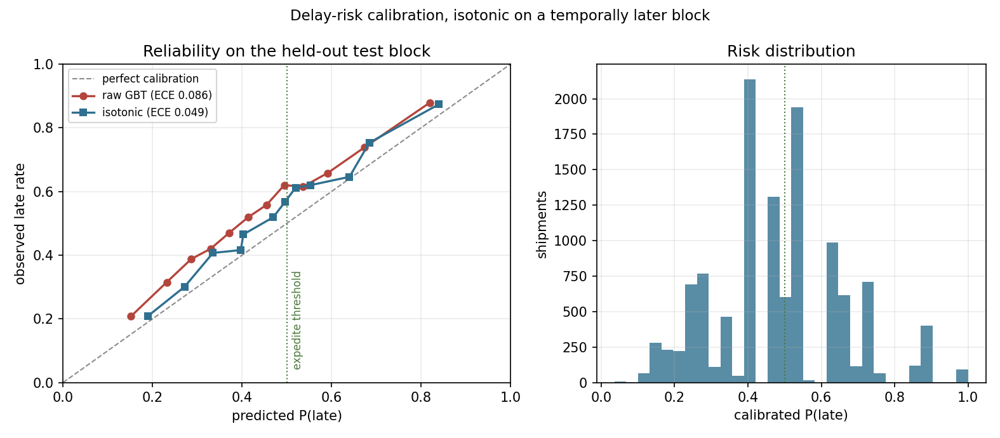

# eta-risk-engine

Predicted ETAs with honest uncertainty, calibrated delay risk, and a cost-matrix decision layer for freight shipments.

[](LICENSE)


## Why this exists

Most ETA projects die the same way. The offline MAE looks excellent, the model ships, and within a quarter the exception desk has stopped trusting it — because the number it produced was a point estimate with no width, the delay probability next to it was not a probability, and nobody had agreed what to do when it read 0.6. The two failure modes underneath that are boring and specific: the offline evaluation used a random split, so the model was scored on shipments whose lane and week it had already seen; and the risk score was fed straight into an expedite rule with no cost matrix, so the rule fired on the wrong half of the book.

This repository is the small version of the pipeline done in the order that survives contact with an operation: temporal evaluation first, then a point model, then intervals with measured coverage, then calibrated probability, then an explicit cost matrix that turns the probability into `expedite` / `notify` / `nothing`, then a drift check on the features.

How this was built, and how it maps to the AI engineering skills map: [AI-ENGINEERING.md](AI-ENGINEERING.md).

## What's implemented

- **Synthetic shipment generator** (`etarisk.generate`) — 10 hubs, 15 lanes, 4 modes, 7 carriers of differing reliability, with AR(1) hub congestion, a Q4 seasonal build, weather with horizon-degrading forecast skill, lognormal customs holds and a truncated Lomax disruption term. The result is right-skewed and heavy-tailed by construction (skew 1.14, excess kurtosis 1.17, p99/p50 = 6.9). Independent named random streams per component follow the common-random-numbers discipline in Law (2015), ch. 11.
- **Leakage-safe features** (`etarisk.features`) — expanding-window temporal folds, out-of-fold smoothed target encoding of lane/mode, carrier and lane-carrier on the delay *ratio*, cyclic calendar terms, great-circle distance. Evaluation follows Bergmeir & Benítez (2012) on serially dependent data.
- **Point ETA** (`etarisk.model`) — `HistGradientBoostingRegressor` on absolute-error loss, so the fit targets the conditional median rather than chasing the Pareto tail.
- **Split-conformal intervals** (`etarisk.model.ConformalETA`) — Lei et al. (2018), with residuals scaled by `sqrt(planned transit)` so a 20-hour road move and a 900-hour ocean move do not get the same interval width. Coverage is measured, not assumed.
- **Delay-risk classifier** (`etarisk.risk`) — boosted trees plus a post-hoc isotonic map (Zadrozny & Elkan, 2002) fitted on a temporally *later* block, reported against a reliability curve and an equal-count ECE.
- **Decision layer** (`etarisk.decision`) — explicit 3-action × 2-outcome cost matrix, expected-cost-minimising action, compared against a fixed carrier-scorecard rule and against an oracle that knows the outcome.
- **PSI drift** (`etarisk.drift`) — one function, quantile-binned, with a categorical fallback for discrete columns and the calendar features excluded (Yurdakul, 2018).

## Quickstart

```bash
git clone https://github.com/echosumeet/eta-risk-engine && cd eta-risk-engine
pip install -e .                     # numpy, pandas, scipy, scikit-learn, matplotlib

python -m unittest discover -s tests -v          # 35 tests
python examples/control_tower.py                 # one shift on the exception desk
python benchmarks/run_benchmarks.py              # regenerates every number below
python -m etarisk run --n 20000                  # CLI: run | figures | drift | describe
```

## Results

Everything below is the output of `benchmarks/run_benchmarks.py` on 60,000 generated shipments over 730 days (36,000 train / 12,000 calibration / 12,000 test, split by ship date). The generator applies a deliberate regime shift on day 430: hub congestion rises by 0.30 and two carriers' disruption rate is multiplied by 1.8, so the test block is genuinely not the training distribution. Test-block late rate is 0.532. Full pipeline: 4.2 seconds on one core.

**Point ETA, held-out test block**

| model | MAE (h) | bias (h) |
| --- | --- | --- |
| quoted transit time | 27.12 | -10.23 |
| HistGradientBoosting, MAE loss | 25.71 | -10.61 |

| horizon bucket | n | MAE (h) | bias (h) |
| --- | --- | --- | --- |
| <2d | 3,804 | 7.96 | -5.09 |
| 2-7d | 3,722 | 17.00 | -7.81 |
| 7-14d | 1,687 | 39.81 | -18.44 |
| 14-30d | 2,787 | 53.05 | -17.13 |

A 5% MAE improvement over the published transit time is a deliberately unflattering headline, and it is the honest one: the quote is built from the same physics, and most of the residual variance in this generator is structurally unobservable at booking time (customs holds, the disruption term, and destination congestion on an arrival day that is weeks away). The value is not in the point number, it is in the width and the probability attached to it.

**Split-conformal coverage**

| alpha | nominal | empirical | mean width (h) | median width (h) |
| --- | --- | --- | --- | --- |
| 0.20 | 0.800 | 0.777 | 59.9 | 44.6 |
| 0.10 | 0.900 | 0.889 | 92.9 | 69.1 |
| 0.05 | 0.950 | 0.943 | 130.0 | 97.2 |

Coverage lands 1-2 points under nominal at every level. That undershoot is the regime shift: split conformal is exchangeability-based, and the calibration block was drawn before the congestion step change.

**Delay-risk calibration**

| scoring | Brier | ECE |
| --- | --- | --- |
| raw GBT | 0.2245 | 0.0863 |
| isotonic | 0.2203 | 0.0492 |



**Decision layer** — cost matrix: late costs 600 / 430 / 150 for `nothing` / `notify` / `expedite`; on-time costs 0 / 80 / 360. Those imply act-thresholds at p = 0.320 (notify) and p = 0.500 (expedite).

| policy | cost per shipment | saved vs fixed rule |
| --- | --- | --- |
| fixed carrier-scorecard rule | 248.87 | — |
| model, uncalibrated p | 221.82 | 10.9% |
| model, isotonic p | 215.30 | 13.5% |
| oracle (knows the outcome) | 79.86 | 67.9% |

The calibration step is worth 2.6 points of cost on its own, which is the entire argument for doing it: the ranking barely changes, but the probabilities move across the 0.500 threshold. The model captures 19.9% of the gap to the oracle.

**Feature drift, train block vs test block (PSI)**

| feature | PSI | verdict |
| --- | --- | --- |
| dest_congestion_obs | 3.37 | broken |
| origin_congestion_obs | 2.40 | broken |
| weather_forecast_origin | 0.109 | shifted |
| te_carrier / te_lane / distance / planned | < 0.005 | stable |

PSI finds the injected regime shift in the two congestion features and leaves the stable ones alone, which is exactly the alert you want on a Monday morning.

## Design notes

**The target encoding is where leakage actually enters.** Everyone knows not to put the label in the feature matrix. What people do instead is compute the lane mean delay over the whole training set, which hands every row a fraction of its own label back, and the effect is largest on the thin lanes where you most need the encoding. `TargetEncoder.oof_transform` computes each row's encoding from strictly earlier shipments only. `tests/test_features.py::test_every_validation_index_is_after_every_training_index` fails the moment anyone reintroduces a random split, and `test_in_sample_encoding_leaks_but_out_of_fold_does_not` shows the in-sample version correlating 0.4+ with pure noise labels while the out-of-fold version stays under 0.10.

**Interval width has to scale.** A single conformal quantile in hours gives an ocean lane the same ±90 hours as a next-day road move. Scaling the residual by `sqrt(planned transit)` costs nothing and produces intervals a planner will actually read. The marginal guarantee does not become conditional, so coverage by horizon bucket is still uneven — check it before you promise anything per-lane.

**Absolute-error loss buys robustness and costs you a bias.** The model runs about 10 hours optimistic on average because the median is well below the mean in a right-skewed distribution. That is correct behaviour for a point ETA on an exception desk (you want the typical case, not the tail-inflated average) and wrong for anything summing ETAs into an inventory position. If you need the mean, model the tail separately rather than switching the loss.

**Calibration decays before accuracy does.** Under the injected regime shift, the classifier's ranking barely degrades while its ECE nearly doubles. That is the normal failure: AUC dashboards stay green while the expedite rule quietly starts firing on the wrong shipments. Recalibrating on a recent block is cheap, needs no retraining, and is the first thing to automate.

**A probability is not a decision.** The cost matrix is a first-class, editable object because the deployment argument is always about those six numbers, not about the model. Publishing the implied thresholds (0.320 / 0.500) is what makes the model auditable to an operations director who has no interest in gradient boosting.

## Limitations & what I'd do next

- Coverage is marginal, not conditional. Mondrian conformal, splitting the calibration set by mode, would fix the horizon-bucket unevenness and is a small change.
- Split conformal assumes exchangeability, which the regime shift violates. Weighted or adaptive conformal (Gibbs & Candès, 2021) would hold nominal coverage under drift; not implemented here.
- The decision layer treats shipments independently. Real expedite capacity is constrained, which makes it a knapsack over the day's book rather than a per-shipment threshold.
- PSI has no significance theory. It is a monitoring convenience; a two-sample test would be the defensible version.
- The cost matrix is static and uniform. In practice it varies by customer contract and by product margin, and the interesting work is estimating it, not optimising against it.
- No online scoring path. The pipeline is batch by design; the feature store contract (what is knowable at booking time) is the hard part and is enforced here only by convention and tests.

## References

- Law, A. M. (2015). *Simulation Modeling and Analysis*, 5th ed. — variance reduction and common random numbers.
- Bergmeir, C. & Benítez, J. M. (2012). On the use of cross-validation for time series predictor evaluation. *Information Sciences* 191, 192-213.
- Lei, J., G'Sell, M., Rinaldo, A., Tibshirani, R. J. & Wasserman, L. (2018). Distribution-free predictive inference for regression. *JASA* 113(523), 1094-1111.
- Zadrozny, B. & Elkan, C. (2002). Transforming classifier scores into accurate multiclass probability estimates. *KDD '02*.
- Gneiting, T. & Raftery, A. E. (2007). Strictly proper scoring rules, prediction, and estimation. *JASA* 102(477), 359-378.
- Gibbs, I. & Candès, E. (2021). Adaptive conformal inference under distribution shift. *NeurIPS 34*.
- Chopra, S. & Meindl, P. (2016). *Supply Chain Management: Strategy, Planning, and Operation*, 6th ed. — transportation service tradeoffs and the cost of unreliability.
- Yurdakul, B. (2018). *Statistical Properties of Population Stability Index*. PhD dissertation, Western Michigan University.

## License

MIT. Copyright (c) 2026 Sumeet.
