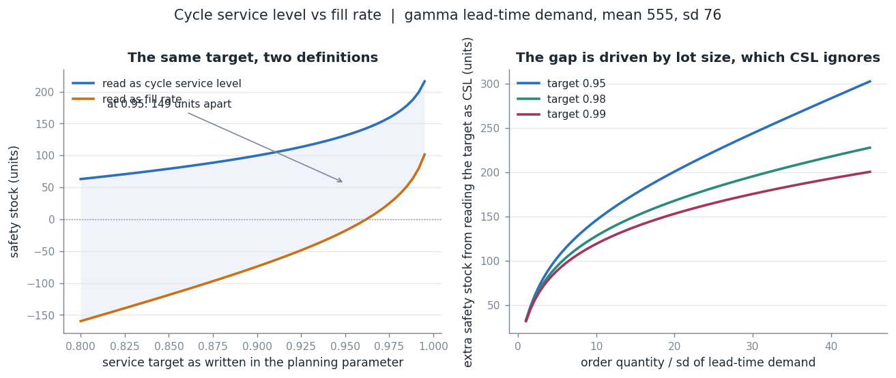
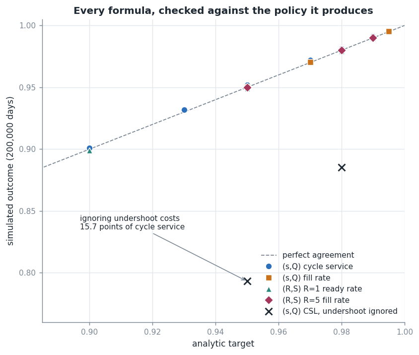
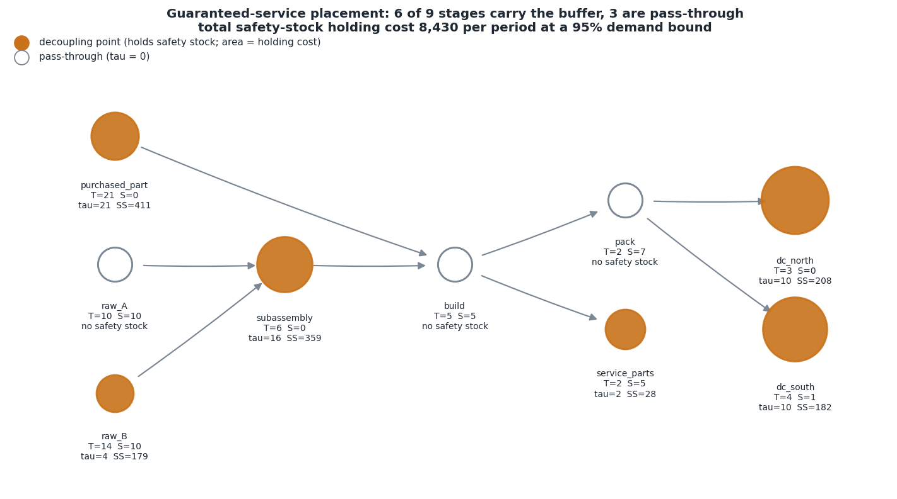
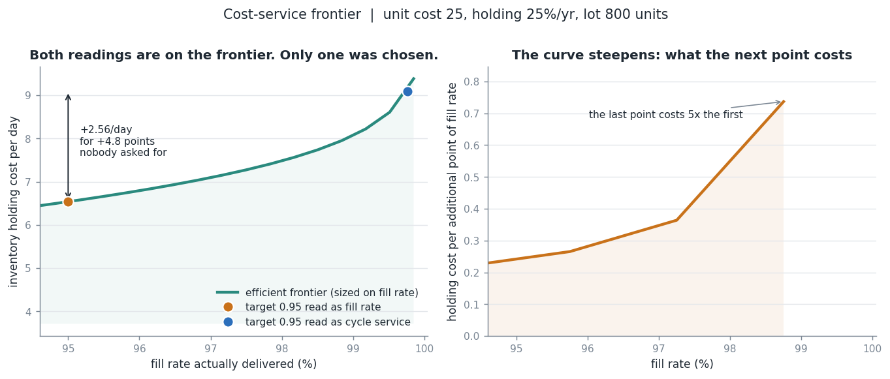

# inventory-policy-kit

Safety stock, replenishment policies, and multi-echelon inventory optimization — with every formula checked against a simulation of the policy it produces.

[](LICENSE)
[](https://www.python.org/)
[](.github/workflows/ci.yml)

How this repository was built, and which AI-engineering skills it does and does not demonstrate: [`AI-ENGINEERING.md`](AI-ENGINEERING.md).

## Why this exists

Almost every planning system ships a reorder point formula, and almost every one
of them is answering a question the business did not ask. The parameter says "95%
service level"; the system reads it as cycle service level; the business measures
fill rate; the two differ by **149 units of safety stock on a completely ordinary
item** — 38% more inventory on hand, in simulation, than the fill-rate target
actually needs, delivering a fill rate of 99.76% that no customer noticed and no
one authorised.

That is not the only silent gap. The same textbook formula ignores undershoot —
the fact that a continuous-review policy reacts to the *transaction that crosses*
the reorder point, not to the point itself — and on the same item that omission is
worth **15.7 points of measured cycle service**. Simulating the policy shows it
immediately. Nobody simulates the policy.

This library implements the inventory theory properly and then does the thing that
makes it trustworthy: it runs a Monte Carlo simulation of the resulting policy and
asserts, in the test suite, that the service level promised is the service level
delivered. Analytic and simulated agree to **within 0.2 service points** across
`(s,Q)`, `(s,S)`, `(R,S)` and `(R,s,S)`.

## What's implemented

**Service and safety stock**

- Cycle service level (type 1) sizing from any lead-time demand distribution.
- **Fill rate (type 2) by loss-function inversion**, exact form
  `fill = 1 - [E(D_L - s)^+ - E(D_L - s - Q)^+] / Q` (Hadley & Whitin 1963;
  Silver, Pyke & Thomas 2016 Ch. 7). Solved by bisection on the loss function,
  which has no closed-form inverse — the reason practitioners quietly substitute
  cycle service instead.
- **Undershoot correction** from the renewal-theoretic equilibrium excess
  distribution, `E[U] = E[X²]/(2E[X])` (Zipkin 2000 §6.6).
- **Empirical forecast-error quantiles** — no distributional assumption, for the
  skewed and fat-tailed errors that a normal fit understates.
- Loss functions in closed form for normal (`G(z)`, `G₂(z)`), gamma, empirical and
  finite mixtures.

**Lead time**

- Variance convolution `Var(D_L) = E[L]Var(d) + E[d]²Var(L)` (Silver, Pyke &
  Thomas 2016 §6.7; Eppen & Martin 1988).
- **Exact mixture over a discrete lead-time pmf** — because moment-matching a
  bimodal lead time to a unimodal shape gets the reorder point wrong by 40% in the
  service range planners actually use.
- Diagnostic: what share of the buffer exists to cover supplier unreliability
  rather than demand variability.

**Policies**

- `(s,Q)` and `(s,S)` continuous review, `(R,S)` and `(R,s,S)` periodic review,
  with the protection interval correctly `R + L` rather than `L`.

**Lot sizing**

- EOQ, EOQ cost sensitivity, all-units quantity discounts.
- **Wagner-Whitin exact dynamic program** (Wagner & Whitin 1958), `O(T²)`,
  verified against exhaustive enumeration on 30 random instances.
- Silver-Meal (Silver & Meal 1973), least-unit-cost, lot-for-lot.

**Newsvendor**

- Critical fractile with normal and empirical demand (Arrow, Harris & Marschak
  1951), plus sensitivity of the answer to a mis-estimated underage cost.

**Multi-echelon**

- **Clark-Scarf** serial-system decomposition with induced penalties (Clark &
  Scarf 1960; Chen & Zheng 1994; Zipkin 2000 Ch. 8), solved numerically on a grid
  and validated against a simulation of the same system.
- **Graves-Willems guaranteed service** safety-stock placement over a supply-chain
  tree, by dynamic program over integer service times (Graves & Willems 2000),
  verified against brute-force enumeration on 20 random trees.

**Network structure**

- Square-root law with correlation and unequal locations, plus the lead-time
  penalty that centralisation actually brings (Eppen 1979).
- Cost-versus-service efficient frontier and the marginal cost of the next point
  of fill rate.

**Evaluation**

- Hand-rolled `heapq` discrete-event simulator handling stochastic lead times,
  order crossing, backorders or lost sales, and sub-period review granularity.

## Quickstart

```bash
git clone https://github.com/echosumeet/inventory-policy-kit
cd inventory-policy-kit
python -m pip install -e ".[figures]"

python -m unittest discover -s tests        # 121 tests, ~17 s
python -m invkit safety-stock               # the headline table
python examples/01_service_target_costs_what.py
```

Runtime dependencies are `numpy` and `scipy` only. `matplotlib` and `networkx` are
needed just to regenerate the figures.

```python
from invkit import LeadTimeSpec, SQPolicy, DemandProcess, simulate_policy
from invkit.leadtime import ltd_with_undershoot
from invkit.safety_stock import ss_from_fill_rate, ss_from_cycle_service_level

spec = LeadTimeSpec.deterministic(demand_mean=100, demand_sd=30, lead_time=5)
ltd = ltd_with_undershoot(spec, txn_mean=100, txn_sd=30)   # includes undershoot
Q = 800.0

fill = ss_from_fill_rate(ltd, target_fill=0.95, Q=Q)
csl = ss_from_cycle_service_level(ltd, target_csl=0.95, Q=Q)
print(fill.safety_stock, csl.safety_stock)      # -18.2   131.1

sim = simulate_policy(
    SQPolicy(s=fill.reorder_point, Q=Q),
    DemandProcess(100, 30, "gamma"),
    lead_time_pmf={5: 1.0},
    n_periods=200_000,
)
print(sim.fill_rate)        # 0.9493 against a 0.95 target
```

The CLI covers the same ground: `safety-stock`, `policy`, `lotsize`,
`newsvendor`, `serial`, `place`, `frontier`, `pooling`.

## Results

All numbers below are produced by `python benchmarks/run_benchmarks.py` and copied
from [`benchmarks/results.md`](benchmarks/results.md). Nothing is estimated.

**Data-generating process.** One reference item, daily buckets: demand is gamma
with mean 100 units/day and standard deviation 30 (CV 0.30), lead time 5 days,
unit cost 25, holding rate 25% per year, ordering cost 250, lot size 800 units.
Gamma rather than normal because it is non-negative and *exactly* closed under
convolution at fixed scale — so lead-time aggregation introduces no error and a
disagreement between formula and simulation is a real defect rather than an
approximation artifact. All data is generated in code; nothing is read from disk.

### The headline: one target, two definitions

| target | Q | Q/σ | SS if read as CSL | SS if read as fill | difference | fill achieved by CSL sizing | CSL achieved by fill sizing |
|---|---|---|---|---|---|---|---|
| 0.95 | 200 | 2.6 | 131 | 61 | 71 | 0.9905 | 0.792 |
| 0.95 | 400 | 5.2 | 131 | 25 | 106 | 0.9953 | 0.643 |
| 0.95 | 800 | 10.5 | 131 | -18 | **149** | 0.9976 | 0.423 |
| 0.95 | 1,600 | 21.0 | 131 | -74 | 205 | 0.9988 | 0.165 |
| 0.98 | 800 | 10.5 | 168 | 37 | 131 | 0.9991 | 0.698 |
| 0.98 | 1,600 | 21.0 | 168 | -3 | 171 | 0.9996 | 0.501 |

Cycle service level does not contain the order quantity. Fill rate does — one big
lot exposes you to a stockout a quarter as often as four small ones, so it needs
far less buffer for the same share of demand served. At the reference lot that is
**149 units, or 3,732 of working capital per SKU**, bought by a definition rather
than by a decision. Note also that the fill-rate answer is *negative* at 95%: with
a large lot you can hold less than mean lead-time demand and still serve 95% of
units. Systems that floor safety stock at zero leave that saving on the table.



### Every formula, checked against the policy it produces

Each policy is built from a closed-form target and simulated for 200,000 days.

| policy / measure | target | s or S | simulated | error |
|---|---|---|---|---|
| (s,Q) cycle service | 0.900 | 654 | 0.9009 | +0.0009 |
| (s,Q) cycle service | 0.950 | 686 | 0.9519 | +0.0019 |
| (s,Q) cycle service | 0.980 | 722 | 0.9811 | +0.0011 |
| (s,Q) fill rate | 0.950 | 536 | 0.9505 | +0.0005 |
| (s,Q) fill rate | 0.980 | 591 | 0.9802 | +0.0002 |
| (s,Q) fill rate | 0.995 | 656 | 0.9951 | +0.0001 |
| (R,S) R=1 ready rate | 0.950 | 504 | 0.9491 | -0.0009 |
| (R,S) R=1 ready rate | 0.980 | 533 | 0.9793 | -0.0007 |
| (R,S) R=5 fill rate | 0.950 | 820 | 0.9501 | +0.0001 |
| (R,S) R=5 fill rate | 0.980 | 872 | 0.9801 | +0.0001 |

**Control.** Drop the undershoot correction and the same 95% cycle-service target
delivers **0.7932** in simulation — 15.7 points short. That is the uncorrected
textbook formula, and it is what most planning systems run.



### Empirical error quantiles vs the normal assumption

Forecast errors drawn from a 90/10 mixture of a tight lognormal and a
promotion-driven spike (skewness 4.87, kurtosis 46.8), rescaled to the reference
standard deviation. The normal comparator uses the *same* aggregated moments, so
the only difference between the columns is shape.

| lead time | target | empirical SS | normal SS | gap |
|---|---|---|---|---|
| 1 day | 0.98 | 98 | 62 | +57.1% |
| 5 days | 0.95 | 134 | 111 | +20.6% |
| 5 days | 0.98 | 197 | 138 | **+42.1%** |
| 5 days | 0.99 | 243 | 157 | +55.2% |
| 20 days | 0.98 | 343 | 276 | +24.1% |

The gap narrows as the lead time lengthens, because summing independent errors
pulls the aggregate toward normal. Short-lead-time, high-skew items are where a
normal fit hurts most — which is the opposite of where most people look.

### Stochastic lead time: exact mixture vs variance convolution

Lead time is 2 days 70% of the time and 14 days 30% of the time. Both models have
identical mean (560) and standard deviation (554); they disagree about shape.
98.4% of lead-time demand variance comes from the lead time, not the demand.

| cycle service target | exact mixture | moment-matched | error of moment matching |
|---|---|---|---|
| 0.75 | 1,291 | 776 | -40% |
| 0.90 | 1,446 | 1,283 | -11% |
| 0.95 | 1,508 | 1,666 | +10% |
| 0.99 | 1,613 | 2,553 | +58% |

Matching two moments to a unimodal shape cannot represent two modes. It
understates the reorder point across the whole range a planner would pick, then
overstates it far out in the tail. The understatement is the dangerous one.

### Lot sizing: exact DP vs the heuristics MRP actually runs

50 random 18-period series, setup 300, holding 1. Wagner-Whitin is exact, so every
gap is a true optimality gap.

| method | mean gap | median gap | worst gap |
|---|---|---|---|
| wagner-whitin | 0.00% | 0.00% | 0.00% |
| silver-meal | 1.60% | 0.82% | 6.92% |
| least-unit-cost | 19.33% | 18.16% | 46.41% |
| lot-for-lot | 69.85% | 68.46% | 89.14% |

All four methods over all 50 instances in **3 ms**. Silver-Meal is usually close
and occasionally 7% off; on a seasonal series with a cheap period before a spike
it hits 9.26%. There has been no computational argument for the heuristic since
about 1975 — the only argument left is that it is what the ERP already does.

### Multi-echelon: Clark-Scarf validated against simulation

| system | echelon base stock | DP cost/period | simulated | gap |
|---|---|---|---|---|
| 2-stage | 387 / 724 | 317.81 | 316.38 | **-0.45%** |
| 3-stage | 268 / 504 / 954 | 407.00 | 405.16 | **-0.45%** |
| 4-stage | 268 / 505 / 841 / 1,394 | 648.57 | 646.40 | **-0.33%** |

Perturbing the 3-stage optimum and re-simulating: store +60 costs +5.82%,
store −60 costs +44.92%, plant +120 costs +9.64%. It is a real optimum, not a
fixed point of the recursion.

### Guaranteed-service placement on a BOM tree

Nine-stage assembly network, 95% demand bound, holding rate 25%. Total safety-stock
holding cost **8,430 per period**, solved in 3 ms.

| stage | T | unit cost | inbound service | outbound service | net repl. time | safety stock | cost/period |
|---|---|---|---|---|---|---|---|
| dc_north | 3 | 55 | 7 | 0 | 10 | 208 | 2,861 |
| dc_south | 4 | 55 | 7 | 1 | 10 | 182 | 2,503 |
| subassembly | 6 | 18 | 10 | 0 | 16 | 359 | 1,613 |
| purchased_part | 21 | 9 | 0 | 0 | 21 | 411 | 924 |
| service_parts | 2 | 50 | 5 | 5 | 2 | 28 | 349 |
| raw_B | 14 | 4 | 0 | 10 | 4 | 179 | 179 |
| raw_A | 10 | 6 | 0 | 10 | 0 | 0 | 0 |
| build | 5 | 42 | 0 | 5 | 0 | 0 | 0 |
| pack | 2 | 48 | 5 | 7 | 0 | 0 | 0 |

**Three of nine stages hold nothing at all.** `build` and `pack` quote a service
time equal to their inbound time plus processing, so they are pure pass-throughs.
`raw_A` holds nothing because `raw_B`, at 4 per unit against 6, is the cheaper
place to absorb the same upstream variability. The placement is invariant to the
service level — only the scale changes with `z`. That is a structurally different
recommendation from "give every stage a 95% service level", and it is why this
model is what network design actually runs.



### Risk pooling, and what breaks it

| locations | correlation | decentralised SS | centralised SS | reduction |
|---|---|---|---|---|
| 8 | 0.0 | 395 | 140 | **64.6%** |
| 8 | 0.3 | 395 | 246 | 37.8% |
| 8 | 0.6 | 395 | 318 | **19.4%** |
| 16 | 0.0 | 790 | 197 | 75.0% |
| 16 | 0.6 | 790 | 624 | 20.9% |

The square-root law assumes independence. Regional demand for the same SKU is
correlated — one national promotion moves every region at once. At a realistic 0.6
the prize is a third of what the independent number promises, and that is before
any of it is spent on the longer outbound lead time centralisation brings: at
ρ = 0.3 with 8 locations, the break-even central lead time is **5.2 days**. Past
that, consolidation increases safety stock.

### Cost-service frontier



The last point of fill rate on this curve costs **5.3×** what the first one did.
That ratio, not a corporate target, is the argument for differentiating service by
segment.

### Runtime

| operation | time |
|---|---|
| fill-rate inversion (gamma, exact) | 5.7 s / 1,000 solves |
| policy simulation | 0.16 s / 100,000 periods |
| Clark-Scarf DP (3 stages) | 90 ms |
| Graves-Willems DP (9 stages) | 3 ms |
| Wagner-Whitin + heuristics (200 periods) | 2 ms |

Python 3.11, numpy 2.4, single core, no compilation step.

## Design notes

Full detail in [`docs/design.md`](docs/design.md). The decisions that matter:

**The loss function is the primitive, not the z-table.** Every service calculation
routes through `E[(D - x)^+]`. Written once against a small distribution
interface, the gamma, normal, empirical and mixture cases all get the same
formulas. A `z` lookup with normality baked in is what makes most planning systems
structurally unable to answer "what if the errors aren't normal?".

**Undershoot is not a rounding error.** `E[U] = μ/2 + σ²/(2μ)` = 54.5 units on the
reference item, comparable to the entire safety stock at a 95% cycle service
target. And the `σ²/(2μ)` term is invariant to how finely you slice the review
period — it is set by the coefficient of variation of the *transaction size*, not
by polling frequency. Moving from a nightly MRP batch to real-time inventory
visibility does not make undershoot go away. Changing how customers order does.
That is worth knowing before you fund the real-time visibility programme.

**Timing conventions are the bug.** Most published disagreement about inventory
formulas is really disagreement about what happens when inside a period. Both
simulators here use *receive → order → demand*, which makes the `(s,Q)` exposure
window exactly `L` and the `(R,S)` protection interval exactly `R + L`. Off by one
period is a silent 20% error in the reorder point on a 5-day lead time. On-hand is
averaged as the midpoint of pre- and post-demand values rather than sampled at the
end, because an end-of-period snapshot understates average inventory by `μ/2` —
exactly the discrepancy that makes a simulated holding cost disagree with `Q/2 + SS`
and sends people looking for a bug that is not there.

**Three service measures, reported separately.** Cycle service, ready rate and
fill rate answer three different questions. For `(R,S)` with `R = 5` the ready
rate is 0.989 against a 0.95 per-cycle target — not because anything is wrong, but
because only the last period of the review cycle is fully exposed. Reporting one
number and calling it "service level" hides that.

**The formulas have a validity region and the tests pin it down.** The `(s,Q)`
cycle-service formula assumes at most one order outstanding. When the lot covers
less demand than the longest lead time, a second order goes out before the first
lands, two orders are exposed to the same demand, and realised service falls
**8.8 points** below target. Long variable lead times with small lots — most
low-volume imported parts — sit squarely in that regime. There is a test that
asserts the failure, so nobody discovers it in production.

**No optimisation library.** `scipy.optimize.milp` was available and not used.
Fill-rate inversion is a monotone scalar root find; Wagner-Whitin is a shortest
path on a DAG; Clark-Scarf is a chain of one-dimensional minimisations;
Graves-Willems is a tree DP. An MILP formulation of any of them would be slower,
harder to explain, and would hide the structural result that makes the method
interesting.

**What I would measure in production.** Not forecast accuracy. Three things:
realised fill rate against target *by segment* (the frontier says the last point
costs 5× the first, so a single corporate number is always wrong somewhere); the
share of safety stock attributable to lead-time variability rather than demand
variability (`lead_time_variance_share` — if it is over half, the fix is a supplier
conversation, not a bigger buffer); and the distribution of undershoot, because
that is a property of the order profile and it silently sets the floor on how well
any continuous-review policy can perform.

## Limitations & what I'd do next

- **The fill-rate inversion is too slow for a catalogue.** 5.7 ms per solve is fine
  for analysis and hopeless for a million-SKU nightly run. The bisection is
  trivially vectorisable across items; the current code solves one at a time. This
  is the first thing I would fix.
- **Everything analytic assumes backordering.** Lost sales changes the recursion.
  The tests currently only demonstrate that backorder-derived parameters
  over-buffer in a lost-sales world; they do not fix it.
- **Demand is iid across periods everywhere.** Autocorrelation during a demand
  regime shift is where buffers actually fail, and bootstrap aggregation of
  forecast errors is too optimistic in exactly that case. Block bootstrap would be
  a cheap improvement; a state-space model would be the honest one.
- **The guaranteed-service model bounds demand.** Demand over `t` periods is
  assumed never to exceed `μt + zσ√t`. That understates the buffer on genuinely
  fat-tailed items, and the failure mode — a zero-safety-stock pass-through stage
  turning out to be the constraint — is well known.
- **No capacity anywhere.** Both multi-echelon models assume uncapacitated stages.
  Capacity generally destroys the tree decomposition that makes Graves-Willems
  exact.
- **Independence across items.** No shared components, no substitution, no
  correlated demand between SKUs. Real assortments have all three, and the
  component-level standard deviation this library computes is too small when two
  finished goods share a demand driver.
- **No intermittent-demand models.** Croston and Syntetos-Boylan feed the same
  distribution interface and would slot in cleanly; slow movers are where the
  normal assumption fails hardest and they are not covered here.

## References

- Arrow, K.J., Harris, T. and Marschak, J. (1951) 'Optimal inventory policy',
  *Econometrica* 19(3), 250–272.
- Chen, F. and Zheng, Y.-S. (1994) 'Lower bounds for multi-echelon stochastic
  inventory systems', *Management Science* 40(11), 1426–1443.
- Chopra, S. and Meindl, P. (2016) *Supply Chain Management: Strategy, Planning,
  and Operation*, 6th ed., Pearson.
- Clark, A.J. and Scarf, H. (1960) 'Optimal policies for a multi-echelon inventory
  problem', *Management Science* 6(4), 475–490.
- Ehrhardt, R. and Mosier, C. (1984) 'A revision of the power approximation for
  computing (s, S) policies', *Management Science* 30(5), 618–622.
- Eppen, G.D. (1979) 'Effects of centralization on expected costs in a
  multi-location newsboy problem', *Management Science* 25(5), 498–501.
- Eppen, G. and Martin, R. (1988) 'Determining safety stock in the presence of
  stochastic lead time and demand', *Management Science* 34(11), 1380–1390.
- Graves, S.C. and Willems, S.P. (2000) 'Optimizing strategic safety stock
  placement in supply chains', *Manufacturing & Service Operations Management*
  2(1), 68–83.
- Hadley, G. and Whitin, T.M. (1963) *Analysis of Inventory Systems*,
  Prentice-Hall.
- Harris, F.W. (1913) 'How many parts to make at once', *Factory* 10(2), 135–136.
- Johnson, M.E., Lee, H.L., Davis, T. and Hall, R. (1995) 'Expressions for item
  fill rates in periodic inventory systems', *Naval Research Logistics* 42, 57–80.
- Silver, E.A. and Meal, H.C. (1973) 'A heuristic for selecting lot size quantities',
  *Production and Inventory Management* 14(2), 64–74.
- Silver, E.A., Pyke, D.F. and Thomas, D.J. (2016) *Inventory and Production
  Management in Supply Chains*, 4th ed., CRC Press.
- Wagner, H.M. and Whitin, T.M. (1958) 'Dynamic version of the economic lot size
  model', *Management Science* 5(1), 89–96.
- Zipkin, P.H. (2000) *Foundations of Inventory Management*, McGraw-Hill.

## License

MIT. Copyright (c) 2026 Sumeet.
