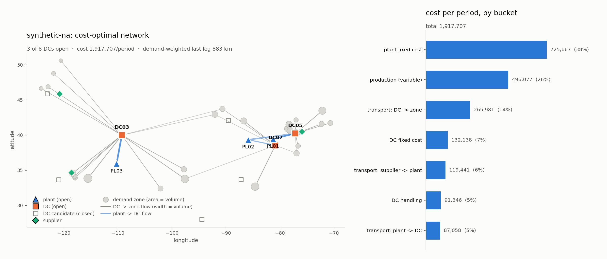
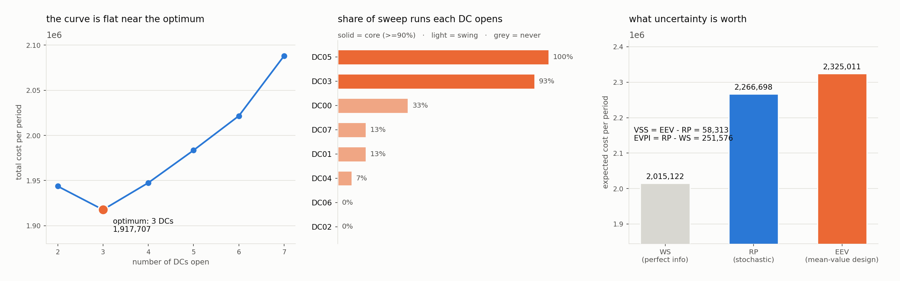

# network-design-milp

Supply chain network design and flow optimization with mixed-integer programming — where the answer is a set of facilities, and the honest deliverable is how much that answer is worth knowing.

[](LICENSE)
[](https://www.python.org/)
[](.github/workflows/ci.yml)

## Why this exists

Network studies get run on one demand forecast, and the output gets presented as
*the* optimal network. On the instance in this repository the optimum opens
three of eight DCs at **1,917,707 per period** — and the best two-DC network is
**+1.36%**, the best four-DC network **+1.56%**. The cost curve is flat over the
whole region anyone would argue about, while the forecast that ranked those
networks is not accurate to 1.5% at any horizon that matters. The "optimal"
network is being selected by noise.

The fix is not a better forecast; it is admitting the forecast is a
distribution. Modelling that explicitly is worth **58,313 per period** here
(VSS, 2.57% of the stochastic optimum), and a *perfect* forecast would be worth
at most **251,576 per period** (EVPI, 11.10%). That second number is the one
that changes behaviour: it is a hard ceiling on any forecast-accuracy
investment, and most such business cases are pitched above it.

This library solves the real models — multi-echelon, multi-commodity,
multi-mode, capacitated, with fixed charges and minimum volumes — on
`scipy.optimize.milp` (HiGHS), on top of a small modelling layer that keeps the
formulation readable, because in network design the expensive errors are
modelling errors that solve cleanly and answer the wrong question.

How this repository was built, and how it maps to the AI Engineering skills map, is in [`AI-ENGINEERING.md`](AI-ENGINEERING.md).

## What's implemented

**Modelling layer** (`netdesign.modeling`)

- Variable registry keyed by meaningful tuples, wildcard selection over a
  positional inverted index, sparse expression algebra, COO/CSR assembly, and a
  thin HiGHS wrapper via `scipy.optimize.milp`.
- `link_big_m` with **no default M** — the tight value must be passed. See
  `docs/design.md` for the measured cost of getting it wrong.
- `elastic_copy(tags)` — clone a model with penalised slacks on selected
  constraint groups, the basis of the feasibility diagnostics.

**Facility location** (`netdesign.facility_location`)

- Uncapacitated and capacitated facility location, single-sourcing and
  minimum-volume variants, `p`-median cardinality constraint.
- **Strong (`x_ij <= y_i`) and aggregated (`sum_j x_ij <= |J| y_i`)
  formulations**, both available so the difference can be measured
  (Balinski 1965; Krarup & Pruzan 1983; Cornuejols, Nemhauser & Wolsey 1990).
- Brute-force enumeration over all open sets, used by the tests.

**Network design** (`netdesign.network_flow`)

- Four echelons, `suppliers -> plants -> DCs -> zones`, multi-commodity, with
  per-lane per-mode transport cost, plant and DC fixed charges, throughput
  ceilings, production and handling cost (Geoffrion & Graves 1974; Chopra &
  Meindl 2015 Ch. 5; Melo, Nickel & Saldanha-da-Gama 2009).
- **Minimum-volume-if-open** thresholds, and **single sourcing** / **minimum
  second-source share** as mutually exclusive service constraints.
- Optional unmet demand priced at lost margin, used as the recourse action.

**Stochastic design** (`netdesign.stochastic`)

- Two-stage deterministic equivalent over demand scenarios, first stage =
  open/close + sourcing structure, second stage = flow.
- **WS / RP / EEV, and the VSS and EVPI pair** (Birge & Louveaux 2011 Ch. 4;
  Santoso et al. 2005), with `WS <= RP <= EEV` asserted on every solve.

**Heuristics and analysis**

- Greenfield center-of-gravity: alternating assignment + weighted geometric
  median on the sphere (Weiszfeld 1937), multi-start, weighted by shipped
  kilograms, then **priced by solving the flow problem with its sites fixed
  open** rather than compared in kilometres.
- Scenario runner, demand x transport-rate sensitivity sweep, and a
  **core / swing / out** partition of the candidate sites by open frequency.
- Feasibility diagnostics: per-commodity capacity ledger, then elastic
  relaxation reporting minimum total violation by constraint group.
- Reporting: cost breakdown, facility utilisation against both capacity and
  minimum volume, flow by echelon and mode, service profile.

**Instance generator** (`netdesign.instances`)

- Reproducible synthetic geographies, haversine lane distances with a road
  circuity factor, affine mode rate cards, heavy-tailed zone demand, and a
  three-level (national / regional / zone) demand scenario sampler.

## Quickstart

```bash
git clone https://github.com/echosumeet/network-design-milp
cd network-design-milp
python -m pip install -e ".[figures]"

python -m netdesign solve --lp-bound          # full network report
python -m netdesign stochastic --scenarios 12 # VSS and EVPI
python -m netdesign sweep                     # sensitivity + core/swing/out
python -m netdesign diagnose --demand-multiplier 1.8 --max-dcs 3
```

In Python:

```python
from netdesign import generate_instance, solve_network_design, NetworkOptions
from netdesign.reporting import format_report

inst = generate_instance(seed=7)
sol = solve_network_design(inst, NetworkOptions(single_source=True))
print(format_report(sol, inst))
```

Regenerate everything in this README:

```bash
make test        # 88 tests, stdlib unittest
make bench       # writes benchmarks/results.md
make figures     # writes docs/*.png
make examples    # runs all five example scripts
```

## Results

All numbers below are the output of `benchmarks/run_benchmarks.py` on
`scipy 1.17.1` (HiGHS), reproduced in full in
[`benchmarks/results.md`](benchmarks/results.md).

### The data-generating process

`generate_instance(seed=7)`: 3 suppliers, 4 plants, 8 DC candidates, 25 demand
zones, 2 commodities (12.0 and 3.2 kg/unit), 339 lanes across 4 modes, 250,000
units/period of demand. Zones are clustered around eight anonymous metro
anchors with log-normal weights, so demand is heavy-tailed the way real
territories are. Lane cost is `rate x km x kg + fixed x kg`, with road and rail
upstream (rail only above 900 km) and LTL and truckload outbound — LTL wins
below roughly 590 km, truckload above. Every DC candidate is sized at ~42% of
total demand and carries a minimum-volume-if-open threshold of 30% of its
capacity. Money is per planning period (read it as a month). **No real
geography, no real rates, no scraped data — everything is generated by
`netdesign.instances`.**

### The chosen network



**1,917,707 per period**, 3 of 8 DCs open (`DC03, DC05, DC07`), 3 of 4 plants.
690 variables (12 binary), 626 rows, 2,752 nonzeros, solved in 0.47s.

| cost bucket | per period | share |
|:---|---:|---:|
| plant fixed cost | 725,667 | 37.8% |
| production (variable) | 496,077 | 25.9% |
| transport: DC -> zone | 265,981 | 13.9% |
| DC fixed cost | 132,138 | 6.9% |
| transport: supplier -> plant | 119,441 | 6.2% |
| DC handling | 91,346 | 4.8% |
| transport: plant -> DC | 87,058 | 4.5% |
| **total** | **1,917,707** | 100.0% |

Demand-weighted last-leg distance 883 km; 1.16 DCs serve the average zone.

### VSS and EVPI — the headline

Twelve equiprobable demand scenarios from the three-level shock model (national
20%, regional 22%, zone 18% standard deviation), spanning 168,044 to 356,804
units/period against a nominal 250,000. Unmet demand priced at 45 per unit
against a ~7.7 per unit landed cost. 26 MILP solves in 12.6s.

| measure | expected cost/period | network |
|:---|---:|:---|
| WS — wait-and-see (perfect information) | 2,015,122 | varies by scenario |
| RP — stochastic here-and-now | 2,266,698 | `DC00 DC03 DC05` |
| EEV — mean-value design, lived with | 2,325,011 | `DC03 DC05 DC07` |

| headline | value | % of RP | reading |
|:---|---:|---:|:---|
| **VSS = EEV − RP** | **58,313** | **2.57%** | what modelling the uncertainty is worth |
| **EVPI = RP − WS** | **251,576** | **11.10%** | ceiling on any forecast investment |

The stochastic design is not the deterministic design: it swaps `DC07` for
`DC00`, a site the mean-demand model never opens. And only **17%** of the
wait-and-see solutions choose the same DC set as the stochastic solution —
which is the honest signal that the *siting* decision is genuinely uncertain,
not merely the flow.



### Formulation strength

Same feasible integer set in every row; only the linking constraints differ.

| formulation | rows | LP bound | MILP optimum | integrality gap | MILP time |
|:---|---:|---:|---:|---:|---:|
| disaggregated link, tight M | 626 | 1,773,829 | 1,917,707 | 7.50% | 0.44s |
| aggregate link, tight M | 100 | 1,722,375 | 1,917,707 | 10.19% | 0.16s |
| aggregate link, M x10 | 112 | 1,084,514 | 1,917,707 | 43.45% | 0.25s |
| aggregate link, M x100 | 112 | 1,019,910 | 1,917,707 | 46.82% | 0.15s |

On the DC-to-zone sub-problem, where the optimum can be checked by enumerating
all 255 open sets:

| formulation | rows | LP bound | MILP optimum | integrality gap |
|:---|---:|---:|---:|---:|
| UFLP, strong | 225 | 439,554 | 439,554 | **0.00%** |
| UFLP, aggregated | 33 | 307,601 | 439,554 | 30.02% |

Brute force over every subset agrees exactly: 439,554 with `DC00, DC04, DC05`.

### What service constraints cost

| variant | cost/period | vs optimum | DCs | DCs/zone | wtd km |
|:---|---:|---:|---:|---:|---:|
| cost-optimal (no service constraint) | 1,917,707 | +0.00% | 3 | 1.16 | 883 |
| single sourcing (one DC per zone) | 1,918,583 | +0.05% | 3 | 1.00 | 849 |
| dual sourcing, 2nd source >= 15% | 1,931,219 | +0.70% | 3 | 2.00 | 1,019 |
| dual sourcing, 2nd source >= 25% | 1,940,753 | +1.20% | 3 | 2.00 | 1,112 |

Single sourcing is nearly free because the cost-optimal answer already sends
most zones to one DC — worth knowing before anyone negotiates it as a
concession. A mandated second source is not free, and it *lengthens* the
average last leg by 26%, because the second-nearest DC is by definition further
away. Resilience bought this way costs service as well as money.

### Greenfield vs the MILP

| p | snapped DCs | wtd km to center | costed | vs MILP optimum |
|---:|:---|---:|---:|---:|
| 2 | DC04 DC05 | 652 | 1,943,742 | +1.36% |
| 3 | DC02 DC04 DC05 | 442 | 1,950,265 | +1.70% |
| 4 | DC01 DC02 DC04 DC05 | 344 | 1,967,151 | +2.58% |
| 5 | DC01 DC02 DC04 DC05 DC06 | 259 | 2,022,594 | +5.47% |

Geography alone lands within **1.36%** — which is why greenfield studies
persist. Note the two curves move in opposite directions: distance keeps
falling with more sites while cost turns around at three, because fixed cost
and capacity are exactly what a continuous location model cannot see.

### Network stability under a 15-cell sweep

Demand x{0.8, 0.9, 1.0, 1.1, 1.25} crossed with transport rates x{0.7, 1.0,
1.4} produced **5 distinct networks** across 15 runs.

| bucket | DCs | meaning |
|:---|:---|:---|
| core | `DC03`, `DC05` | open in >=90% of runs — commit |
| swing | `DC00`, `DC01`, `DC04`, `DC07` | the actual decision |
| out | — | never open |

Cost elasticity to demand (log-log slope) **0.84**: the network absorbs growth
better than proportionally, which is the economies-of-scale claim made
falsifiable.

### Scaling

| instance | DCs x zones x SKUs | vars | binary | rows | nonzeros | root gap | MILP time |
|:---|:---|---:|---:|---:|---:|---:|---:|
| small | 5x12x1 | 133 | 8 | 118 | 508 | 10.80% | 0.03s |
| default | 8x25x2 | 690 | 12 | 626 | 2,752 | 7.50% | 0.41s |
| large | 16x60x3 | 4,543 | 22 | 4,154 | 18,398 | 0.95% | 3.74s |

## Design notes

Full version in [`docs/design.md`](docs/design.md). The parts worth arguing
about:

**The flat optimum is the finding, not a disappointment.** Three networks sit
within 1.6% of each other and the sweep only ever opens five distinct sets. So
the deliverable from a network study is not the optimal set — it is the
core/swing/out partition. `DC03` and `DC05` open in essentially every run;
commit to them and stop paying consultants to re-derive them. The argument
belongs entirely on the swing sites, where the qualitative factors a cost model
cannot see (labour market, tax, customer perception, exit terms) legitimately
decide it.

**Big-M is not a formatting preference.** Same feasible set, same optimum, and
an integrality gap of 7.50% or 46.82% depending on whether the linking bound is
`min(capacity, routable demand)` or "a big number". `Model.link_big_m` has no
default, so the tight value has to be worked out once instead of guessed
forever. The honest caveat, because the benchmark says so: HiGHS presolve does
coefficient tightening and recovers most of the *wall-clock* loss at these
sizes. The bound is still the right diagnostic — it predicts what happens once
side constraints stop presolve from seeing through the structure.

**Independent demand noise is why published VSS numbers are zero.** Draw
per-zone shocks independently across 25 zones and the aggregate diversifies
away, the stochastic optimum collapses onto the mean-value optimum, and VSS is
exactly 0 — an artefact of the sampler, not a property of the problem. The
variance that moves a network design is the part that does not diversify: a
national factor moving total volume against fixed capacity (drives *whether* to
hedge) and a regional factor moving volume between metros (drives *where*). The
test suite asserts the correlated sampler produces >3x the aggregate spread of
the independent one at comparable per-zone variance.

**Recourse has to be an available action or the stochastic model is
meaningless.** Without priced unmet demand the mean-value design is simply
infeasible in high scenarios, `EEV = +inf`, and VSS is undefined. "Your plan
fails" is not a quantity anyone can trade against a lease. Pricing shortfall at
lost margin is what converts it into one — and it makes the penalty an explicit
input that should come from gross margin rather than being buried as a solver
tolerance.

**Single sourcing is a first-stage decision.** It looks like routing, so it
often gets modelled as second-stage, which quietly assumes you re-source every
customer every period. It is a commercial arrangement — one carrier
relationship, one bill of lading — and modelling it as recourse flatters the
answer.

**"Infeasible" is not an answer.** The diagnostics return a capacity ledger
first (most infeasibilities are one number in that table) and then a minimum
total violation by constraint group. On the stressed instance in
`examples/04_infeasibility_triage.py` the elastic relaxation reports 61,271.6
units of violation, and solving the same instance with shortfall priced in
returns 61,271 units unserved — the same linear programme read from two
directions. What that tells the room is that the DC cap was never the binding
constraint; contracted supply was.

**Cost-optimal is not service-optimal.** The optimum here puts the average unit
883 km from its DC, which no consumer-facing network would accept. That is a
property of a pure cost objective, not a bug — and it is why the reporting
carries demand-weighted and p90 last-leg distance next to the cost, so the
trade is visible instead of implicit.

## Limitations & what I'd do next

- **No inventory in the objective.** Real DC-count decisions are driven as much
  by safety stock — which grows roughly with the square root of the number of
  stocking locations — as by transport. That term is concave in the open count
  and is the single most important missing piece; a piecewise-linear
  approximation over the number of open DCs would fit the MILP directly.
- **Single period.** No phasing, no lease terms, no opening or closing cost, so
  the model cannot answer "when". A multi-period version with
  open/close/transition variables is a natural extension and roughly triples
  the binary count.
- **Service is a reported metric, not a constraint.** There is no maximum
  transit time or minimum next-day coverage. Both are easy to add as lane
  eligibility or covering constraints; they were left out so the cost/service
  trade stays visible rather than being pre-decided by a parameter.
- **Scenario count is small.** Twelve scenarios is enough to demonstrate VSS
  and EVPI and far too few to trust the magnitudes. The right next step is
  sample average approximation with confidence intervals on the optimality gap
  (Kleywegt, Shapiro & Homem-de-Mello 2002), not simply more scenarios.
- **No decomposition.** The deterministic equivalent is solved monolithically,
  which is fine at 12 scenarios and will not be at 500. Benders decomposition
  with the L-shaped method is the standard answer and would sit naturally on
  top of the existing modelling layer.
- **Risk neutrality.** RP minimises expected cost. A board that cares about the
  bad tail wants CVaR, which is linear-representable (Rockafellar & Uryasev
  2000) and would change which sites open.
- **`scipy.optimize.milp` has no warm start or callbacks.** The heuristic
  incumbent is imposed as an objective cutoff instead; the benchmark shows it
  buys nothing at these sizes. A commercial solver interface would be a thin
  addition to `modeling.py`.

## References

- Balinski, M. L. (1965). Integer programming: methods, uses, computation.
  *Management Science* 12(3).
- Birge, J. R., & Louveaux, F. (2011). *Introduction to Stochastic
  Programming*, 2nd ed. Springer. (Ch. 4: EVPI and VSS.)
- Chopra, S., & Meindl, P. (2015). *Supply Chain Management: Strategy,
  Planning, and Operation*, 6th ed. Pearson. (Ch. 5: network design.)
- Cornuejols, G., Nemhauser, G. L., & Wolsey, L. A. (1990). The uncapacitated
  facility location problem. In *Discrete Location Theory*, Wiley.
- Geoffrion, A. M., & Graves, G. W. (1974). Multicommodity distribution system
  design by Benders decomposition. *Management Science* 20(5).
- Kleywegt, A. J., Shapiro, A., & Homem-de-Mello, T. (2002). The sample average
  approximation method for stochastic discrete optimization. *SIAM Journal on
  Optimization* 12(2).
- Krarup, J., & Pruzan, P. M. (1983). The simple plant location problem: survey
  and synthesis. *European Journal of Operational Research* 12(1).
- Melo, M. T., Nickel, S., & Saldanha-da-Gama, F. (2009). Facility location and
  supply chain management — a review. *European Journal of Operational
  Research* 196(2).
- Rockafellar, R. T., & Uryasev, S. (2000). Optimization of conditional
  value-at-risk. *Journal of Risk* 2(3).
- Santoso, T., Ahmed, S., Goetschalckx, M., & Shapiro, A. (2005). A stochastic
  programming approach for supply chain network design under uncertainty.
  *European Journal of Operational Research* 167(1).
- Weiszfeld, E. (1937). Sur le point pour lequel la somme des distances de n
  points donnés est minimum. *Tohoku Mathematical Journal* 43.
- Huangfu, Q., & Hall, J. A. J. (2018). Parallelizing the dual revised simplex
  method. *Mathematical Programming Computation* 10(1). (HiGHS, the solver
  behind `scipy.optimize.milp`.)

## License

MIT — see [LICENSE](LICENSE).
