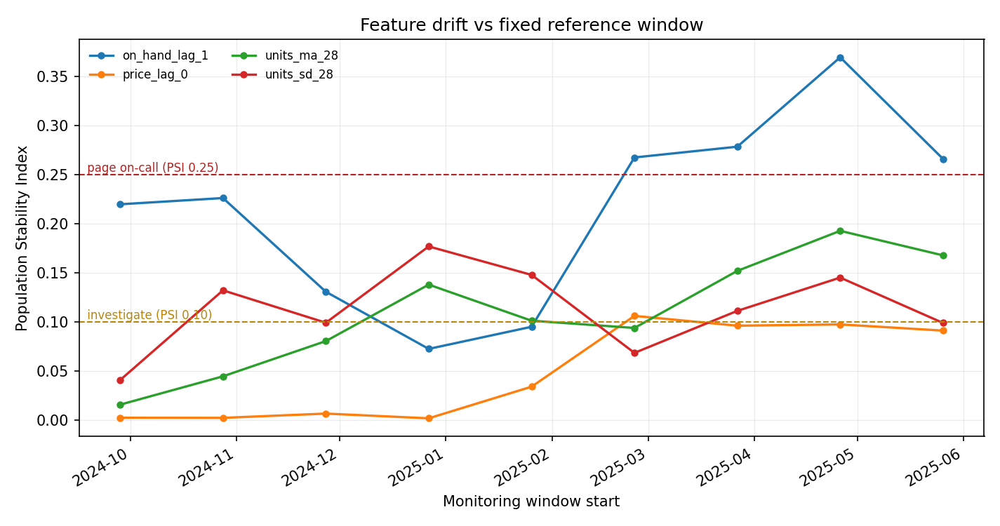

# scm-ml-platform

Data contracts, point-in-time features, a release gate scored in inventory cost, and drift monitoring for supply chain forecasting models.

[](LICENSE)
[](pyproject.toml)
[](.github/workflows/ci.yml)

## Why this exists

Forecasting programmes rarely fail on the model. They fail when a planner stops trusting the number, and the thing that breaks trust is almost never a worse algorithm. It is an upstream feed that changed a column and nobody told the consumer; a feature that was computed from data which did not exist at decision time and therefore backtested beautifully; a serving path that fills nulls differently from the training path; a mix shift that leaves the aggregate metric flat while one category quietly goes wrong.

Every one of those is invisible to a metric dashboard and obvious to a check that runs before the release. This repository is the set of checks: a contract on the inputs, an automated point-in-time audit on the features, a merge gate that scores accuracy *and* the inventory cost of the resulting order decisions, a registry that can roll back in one call, and monitoring that reports by slice.

The documentation is a first-class part of it. A platform like this is a product decision as much as an engineering one, so the [PRD](docs/prd/forecasting-platform.md), the [six ADRs](docs/adr/), the [metric tree](docs/metrics.md) and the [on-call runbook](docs/runbook.md) are written out in full.

[AI-ENGINEERING.md](AI-ENGINEERING.md) maps this repository, and how it was built, against Andrew Ng's four AI Engineering skills.

## The demo this leads with: catching a leakage bug

Two bugs are seeded into a feature set. Both are the kind a reviewer waves through: a column read at lag 1 that the source system does not actually settle for a week, and a per-SKU mean computed over the full sample. Neither is visible in the dataframe. The audit catches both, and each is caught by a *different* check:

```console
$ scmplatform audit --leaky
FAIL: 2 leakage finding(s)
  [knowledge_time] returns_lag_1: returns_units settles 7d after the event but the spec uses lag=1
  [truncation] sku_mean_units: 120 row(s) changed when history was truncated to the label date (max abs diff 11.8230); the feature reads future data
```

`knowledge_time` is declarative: each source column carries the delay before its value is settled, and a spec that reads it sooner is rejected regardless of how causal the code looks. `truncation` is empirical: features are recomputed from history truncated at the label timestamp, and any value that moves is a function of the future.

Neither check subsumes the other. The first misses full-sample group statistics that only touch past columns; the second misses columns that are backfilled late upstream. Both run in CI, and the production feature set returns clean:

```console
$ scmplatform audit
PASS: 7 feature specs are point-in-time correct
```

## What's implemented

- **Data contracts** — declarative column specs with dtype, nullability, range, enum, primary-key uniqueness and freshness expectations; a validation engine over pandas frames returning a per-rule violation report with error/warn severities.
- **Breaking-change detection** — diffs two contract versions and classifies each change. Dropped columns, dtype changes, newly-required columns, tightened bounds or enums, a changed key and a stricter freshness SLA are breaking; added-nullable and relaxed constraints are not.
- **Point-in-time feature specs** — declarative lag/window transforms with the two-check leakage audit above, plus a training/serving skew detector that compares the two paths on shared keys and reports per-feature mismatch rate and signed gap.
- **Model registry** — file-backed JSON. Model cards, parent-pointer lineage, dev/staging/production/archived stage transitions with automatic archival of the incumbent, an append-only history log, and single-call rollback to the previous production version.
- **Backtest-in-CI gate** — expanding-window rolling-origin backtest (`HistGradientBoostingRegressor`) with a three-arm gate on wMAPE, signed bias and realised inventory cost per unit, plus champion/challenger promotion scored on cost.
- **Decision quality** — forecasts pushed through a periodic-review order-up-to policy with a newsvendor critical ratio (Silver, Pyke & Peterson 1998, ch. 7; Chopra & Meindl ch. 12), reporting realised cost against the irreducible cost a perfect forecast would still incur.
- **Monitoring** — Population Stability Index and two-sample Kolmogorov-Smirnov feature drift, prediction drift, PSI-over-time series, and slice-level wMAPE/bias with automatic flagging.

Accuracy metric choice (wMAPE plus signed bias, and why not MAPE or MASE) is argued in [ADR-0004](docs/adr/0004-accuracy-metric-selection.md), following Hyndman & Koehler (2006).

## Quickstart

```bash
git clone https://github.com/echosumeet/scm-ml-platform
cd scm-ml-platform
python -m pip install -e .

python -m unittest discover -s tests -v     # 35 tests
scmplatform audit --leaky                   # the leakage demo above
scmplatform backtest --folds 4              # the release gate
python examples/01_release_pipeline.py      # contract -> gate -> registry -> monitoring
python benchmarks/run_benchmarks.py         # regenerates every number below
```

## Results

All numbers below come from `python benchmarks/run_benchmarks.py` in this repository; the full output is committed at [`benchmarks/results.md`](benchmarks/results.md).

**Data-generating process.** 40 SKUs × 540 daily periods = 21,600 rows, seed 7. Daily demand per SKU is multiplicative — weekly and annual seasonality, a linear trend, a promotion lift on roughly 7% of days, and a constant-elasticity price response — drawn from a Poisson distribution. Long-tail items are scaled to 12% of base volume so that one slice is genuinely harder. A permanent +30% price step is applied to one third of the SKUs from day 405 onward, which is the drift the monitoring section detects. Two columns, `returns_units` and `settled_margin`, carry knowledge delays of 7 and 14 days and exist only to make point-in-time violations reproducible.

### The release gate

Expanding-window backtest, 4 folds, 14-day horizon. The challenger is the same model with predictions scaled by 0.85 — a deliberate under-forecast, the classic way to buy a metric.

| metric | champion | challenger |
| --- | --- | --- |
| wMAPE | 0.1865 | 0.2223 |
| bias | -0.0020 | -0.1517 |
| cost per unit | 0.1995 | 0.7038 |
| regret | 12,019.84 | 51,314.24 |
| fill rate | 0.9957 | 0.9815 |

```console
$ scmplatform backtest --folds 4
PASS gate for model
               wmape: 0.1865
                bias: -0.0020
                rmse: 10.0793
               units: 77,926.0000
       realised_cost: 15,548.4597
    irreducible_cost: 3,528.6170
              regret: 12,019.8427
       cost_per_unit: 0.1995
     regret_per_unit: 0.1542
           fill_rate: 0.9957
```

The gate result on the challenger: `FAIL gate for challenger: |bias| 0.1517 > 0.0800; cost/unit 0.7038 > 0.2500`, and the promotion decision is **HOLD**.

This is the reason the gate has a cost arm. On accuracy alone the challenger is 3.6 points of wMAPE worse — a number two reasonable people can argue about in a review. In inventory cost it is **3.5× worse per unit**, which is not arguable. Realised cost across the backtest is 15,548 against an irreducible 3,529, so 4.41× the cost a perfect point forecast would still incur under the same service target; the 12,020 gap is the part a better model could actually recover.

### Feature drift

Reference is the first 70% of the panel, current the remainder.

| feature | psi | band | ks_stat | ks_pvalue | ref_mean | cur_mean |
| --- | --- | --- | --- | --- | --- | --- |
| on_hand_lag_1 | 0.1628 | moderate | 0.0782 | 0.0000 | 178.21 | 183.96 |
| price_lag_0 | 0.0696 | stable | 0.0858 | 0.0000 | 27.36 | 29.66 |
| units_ma_28 | 0.0582 | stable | 0.0612 | 0.0000 | 36.22 | 34.36 |
| units_sd_28 | 0.0471 | stable | 0.0561 | 0.0000 | 15.37 | 13.97 |
| units_ma_7 | 0.0344 | stable | 0.0549 | 0.0000 | 36.30 | 33.69 |
| units_lag_1 | 0.0159 | stable | 0.0452 | 0.0000 | 36.32 | 33.49 |
| promo_lag_0 | 0.0000 | stable | 0.0057 | 0.9985 | 0.073 | 0.067 |

Note the disagreement, which is the point of reporting both. KS returns p-values below 0.001 on six of seven features; at 21,600 rows it detects shifts that are statistically real and operationally meaningless. PSI puts one feature in the investigate band and the rest at stable, which is the correct action.



The figure splits the same data into 30-day monitoring windows against a fixed reference period. `price_lag_0` sits at PSI ≈ 0.00 until the injected price step, then climbs to the investigate band and stays there — a step change, not noise. `on_hand_lag_1` crosses the page threshold, which is the expected behaviour of a random-walk inventory level and precisely the kind of feature that should not be alert-worthy on its own.

### Slice-level performance

Overall wMAPE 0.1865; 1 of 3 slices exceeds 1.25× that level.

| category | rows | units | wMAPE | bias | ratio to overall | flagged |
| --- | --- | --- | --- | --- | --- | --- |
| longtail | 728 | 5,582 | 0.3322 | 0.0260 | 1.78 | yes |
| seasonal | 728 | 32,079 | 0.1774 | -0.0020 | 0.95 | no |
| core | 784 | 40,265 | 0.1736 | -0.0059 | 0.93 | no |

The aggregate is the number that lies. Long-tail items carry 78% more error than the headline and 6% of the volume, so they are invisible in a volume-weighted metric and highly visible to the planner who owns them.

### Data contract

On a feed with injected faults — dropped joins, un-netted returns, a units-of-measure error and a replayed extract:

```
FAIL demand_panel@1.0.0: 21605 rows, 4 error rule(s), 0 warning rule(s)
  units     min_value   36  36 rows < 0.0
  price     not_null    54  54 null values
  price     max_value   24  24 rows > 500.0
  sku+date  unique_key   5  5 duplicate keys
```

And a proposed schema change is classified before it merges: dropping `on_hand` and tightening the freshness SLA from 2 days to 1 both come back **breaking**, while adding a nullable column does not.

## Design notes

**Point-in-time correctness needs two checks, not one.** This is the part most teams get half right. The truncation check — recompute from truncated history, assert nothing moves — is the rigorous one, and it catches full-sample statistics that no amount of code review reliably catches. But it is blind to a column that is backfilled late in the source system, because the historical table looks the same either way. That failure only shows up as a model that backtests well and underperforms in production by a consistent margin, which is the hardest bug in this domain to diagnose. The declarative knowledge-delay check costs one dictionary and catches it at spec time.

**Accuracy-only gates select for under-forecasting.** A model that shades every prediction down looks better on any symmetric error metric weighted by volume, because the large errors on high-demand days shrink faster than the small ones grow. It also runs the inventory position down, which is invisible until the fill rate moves. Putting realised inventory cost in the gate makes the trade explicit at merge time rather than in a post-mortem, and the numbers above show why: a 3.6-point accuracy difference is a 3.5× cost difference.

**Report regret, not cost.** Absolute inventory cost invites "compared with what". The baseline here is the same safety-stock policy driven by a perfect point forecast — which still holds safety stock and still costs money, because the policy is set for a service target, not for certainty. The gap between the two is the only number that survives a finance review.

**The registry is a directory of JSON files, deliberately.** What matters at 02:00 is answering "what is serving, what was serving, and can I put the old one back", and every one of those answers should be readable with `cat`. Storage sophistication buys nothing here; ADR-0001 makes the same argument about not buying a feature store.

**PSI thresholds are operational, KS p-values are not.** At panel scale, KS will flag essentially everything. PSI bands (0.10 investigate, 0.25 page) are stable across sample sizes and are what an on-call engineer can act on. Both are reported because a retraining review wants the significance test and a dashboard does not.

**Slice monitoring is not optional, and it is not free.** Running it on every backtest rather than on request is the only way it happens. The cost is alert volume, which is why slices are flagged only above a minimum row count and a ratio threshold, and why alert volume is itself on the review agenda in the PRD.

## Limitations and what I'd do next

- **Point forecasts only.** The order-up-to policy takes safety stock from a single residual standard deviation, which understates uncertainty for intermittent and long-tail items. Quantile forecasts with a pinball-loss gate arm are the right next step, and would let the safety factor come from the model rather than a Gaussian assumption.
- **The truncation check is sampled, not exhaustive.** It probes a set of as-of dates rather than every row, so a leak confined to a narrow window could pass. Exhaustive checking is O(rows × specs) recomputations and would not fit a CI budget as written.
- **Cost parameters are assumed, not estimated.** Holding rate, shortage multiple and review period are inputs. The cost metric is only as credible as they are, and the PRD flags ownership of those parameters as an open question for exactly that reason.
- **Single-echelon, single-location.** No lead-time variability, no network. Multi-echelon safety stock (Graves & Willems, 2000) would change the cost mapping materially.
- **Skew is detected after the fact.** Comparing offline and online frames catches a divergence that already shipped. A shared serving runtime would prevent it, at the cost of the infrastructure ADR-0001 declines to buy.
- **No overrides in the loop.** ADR-0005 sets the policy; the code does not yet capture override records or measure their value-add, which is the missing input to the trust metric in the PRD.
- **Synthetic data throughout.** The data-generating process is stated so the numbers are interpretable, but it is well-behaved in ways real planning feeds are not — no structural breaks in the demand process itself, no new-item cold starts, no returns seasonality.

## References

- Silver, E. A., Pyke, D. F., & Peterson, R. (1998). *Inventory Management and Production Planning and Scheduling* (3rd ed.). Wiley. — periodic-review order-up-to policy and the newsvendor critical ratio.
- Chopra, S., & Meindl, P. (2015). *Supply Chain Management: Strategy, Planning, and Operation* (6th ed.). Pearson. — safety stock and service-level economics, ch. 12.
- Hyndman, R. J., & Koehler, A. B. (2006). Another look at measures of forecast accuracy. *International Journal of Forecasting*, 22(4), 679–688.
- Hyndman, R. J., & Athanasopoulos, G. (2021). *Forecasting: Principles and Practice* (3rd ed.). OTexts. — rolling-origin evaluation.
- Graves, S. C., & Willems, S. P. (2000). Optimizing strategic safety stock placement in supply chains. *Manufacturing & Service Operations Management*, 2(1), 68–83.
- Fildes, R., Goodwin, P., Lawrence, M., & Nikolopoulos, K. (2009). Effective forecasting and judgmental adjustments. *International Journal of Forecasting*, 25(1), 3–23.
- Siddiqi, N. (2006). *Credit Risk Scorecards: Developing and Implementing Intelligent Credit Scoring*. Wiley. — the standard Population Stability Index formulation and its interpretation bands.
- Sculley, D., et al. (2015). Hidden technical debt in machine learning systems. *NeurIPS*. — training/serving skew and entanglement.
