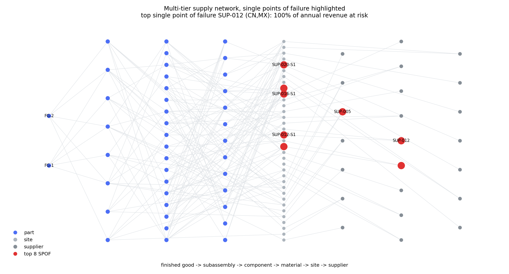

# supplier-risk-graph

Multi-tier supplier risk on a typed supply network: n-tier BOM expansion, single-point-of-failure
ranking in dollars, hidden shared sub-tier supplier detection, Monte Carlo disruption simulation and
mitigation scoring per dollar spent.

[](LICENSE)
[](pyproject.toml)
[](.github/workflows/ci.yml)

How this was built, and how it maps to the AI Engineering skills map: [AI-ENGINEERING.md](AI-ENGINEERING.md).

## Why this exists

Every company knows its tier 1. Almost none can answer a question about tier 3 without a two-week
survey exercise, and the surveys come back with the tier-1 supplier's preferred answer rather than
its actual sub-tier. So the risk report gets built on the layer that is visible, concentration looks
healthy, and then a single plant nobody had heard of floods and four independent-looking tier-1
suppliers stop shipping the same week.

The failure mode is not "we had a single source". It is "we had four sources that were the same
source three levels down". This library models the network deep enough to see that, ranks what it
finds by revenue at risk rather than by graph centrality, and prices the fixes.

## What's implemented

- **Typed, validated network model** — parts, sites and suppliers as distinct node types, BOM edges
  with quantity-per, sourcing edges with allocation shares, geography and capacity. Loader is
  pydantic-validated and rejects unbalanced shares, dangling references and BOM cycles. Disruption
  parameters live on the site, not the supplier, because that is where they physically apply.
- **N-tier expansion** — finished good exploded to raw materials with quantity accumulated across
  every path, which is the standard MRP explosion (Vollmann, Berry, Whybark and Jacobs,
  *Manufacturing Planning and Control for Supply Chain Management*).
- **SPOF detection** — articulation points of the undirected projection (Hopcroft-Tarjan, via
  `networkx`) plus sole-source parts, ranked by re-running the availability kernel with the node
  removed. Structure finds the candidates; revenue orders them.
- **Concentration** — Herfindahl-Hirschman index on spend shares by tier, by supplier and by
  country, with effective-source counts (Chopra and Sodhi, *Managing Risk to Avoid
  Supply-Chain Breakdown*, MIT SMR 2004).
- **Hidden shared sub-tier suppliers** — the diamond dependency that tier-1 diversity hides. Each
  sub-tier supplier is walked back up to the set of tier-1 branches it reaches; convergence is
  flagged and priced. This is the headline capability.
- **Monte Carlo disruption simulation** — per-site occurrence, start day and lognormal recovery,
  evaluated on event-boundary intervals so overlapping outages compound. Returns expected loss,
  95th-percentile loss, time-to-recover and service level (Simchi-Levi et al., *Identifying Risks
  and Mitigating Disruptions in the Automotive Supply Chain*, Interfaces 2015; Sheffi,
  *The Resilient Enterprise*).
- **Mitigation scoring** — dual sourcing, buffer stock and pre-qualification, each re-simulated
  under common random numbers and scored as risk reduction per dollar of annual cost.

Not implemented on purpose: probabilistic cascade propagation, and any live event-ingestion adapter.

## Quickstart

```bash
git clone https://github.com/echosumeet/supplier-risk-graph && cd supplier-risk-graph
pip install -e .

python -m unittest discover -s tests -v      # 35 tests
python examples/tier3_review.py              # the full review, end to end
python benchmarks/run_benchmarks.py          # regenerates every number below

python -m riskgraph concentration            # or: spof, expand, simulate, mitigate, figure
python -m riskgraph generate --seed 7 --out network.json
```

Everything runs from a generated network, so there is nothing to download. To use your own data,
write the same JSON schema and pass `--network path.json`.

## Results

**Data-generating process.** Two finished goods share a pool of 8 tier-1 subassemblies, each of
which consumes 3 of 18 tier-2 components, each of which consumes 2 of 12 tier-3 materials. Sourcing
multiplicity thins with depth (probability of a second qualified source 0.97 / 0.92 / 0.78 by tier),
shares are Dirichlet-drawn, and sites are placed across 8 countries with country-specific annual
disruption rates (3%-8.5%) and mean recovery times (24-62 days, scaled up by tier). One specialty
material, `MAT-CRIT`, is planted under four distinct tier-1 branches and sole-sourced from a single
site; because that site also supplies other materials, the detector reaches it through all
five of FG-1's tier-1 branches. All figures below are from `benchmarks/run_benchmarks.py`, seed 7 unless stated.

### The problem in one table

| view | what it says |
|---|---|
| tier-1 HHI | 0.163 — about 6 effective suppliers, passes any sourcing review |
| geographic HHI | 0.170 — top country 24% of spend |
| supplier HHI overall | 0.062 — 23 suppliers, no obvious concentration |
| top hidden dependency | `SUP-020`, depth 3, reached through **5 of 5** tier-1 branches, **100%** of revenue |

The concentration metrics are all healthy. The network still has a depth-3 node that takes the
entire product with it.

### Hidden shared sub-tier suppliers (seed 7)

| supplier | depth | tier-1 branches reached | parts | revenue at risk, all products ($M) | share of FG-1 |
|---|---|---|---|---|---|
| SUP-020 | 3 | 5 | 4 | 318.2 | 100% |
| SUP-012 | 2 | 4 | 3 | 318.2 | 100% |
| SUP-011 | 2 | 4 | 4 | 252.3 | 86% |
| SUP-016 | 2 | 3 | 4 | 272.3 | 86% |
| SUP-017 | 3 | 5 | 4 | 246.7 | 78% |

Across 5 generated instances the planted diamond is recovered as the **top-ranked** hidden
dependency in 5/5 cases.

### Single points of failure, ranked by revenue at risk

| node | revenue at risk ($M) | share | articulation point | sole-sourced parts | mean recovery (d) |
|---|---|---|---|---|---|
| supplier:SUP-012 | 318.2 | 100% | no | 1 | 65 |
| site:SUP-012-S1 | 318.2 | 100% | no | 1 | 56 |
| site:SUP-020-S1 | 318.2 | 100% | yes | 1 | 67 |
| site:SUP-016-S1 | 272.3 | 86% | yes | 0 | 37 |
| supplier:SUP-005 | 254.4 | 80% | no | 0 | 48 |

Degree centrality agrees with this ranking on **3 of the top 8** nodes. Two of the top three
revenue-at-risk nodes are not articulation points at all.

### Disruption simulation (2,000 trials, one-year horizon)

| scenario | P(shortfall) | expected loss ($M) | p95 loss ($M) | mean TTR (d) | p95 TTR (d) | service level |
|---|---|---|---|---|---|---|
| baseline | 81.4% | 31.4 | 93.3 | 70 | 154 | 90.1% |
| no ramp-up flex | 83.2% | 38.2 | 104.4 | 71 | 154 | 88.0% |
| 4 weeks buffer on MAT-CRIT | 81.4% | 29.8 | 86.4 | 70 | 154 | 90.6% |

The tail is three times the mean. Planning to the expected value here would under-fund the response
by a factor of three, which is the usual argument for holding the p95 in the risk register instead.

### Mitigation, ranked by risk reduction per dollar

| action | target | annual cost ($) | expected loss after ($M) | risk reduction ($) | reduction per $1 |
|---|---|---|---|---|---|
| prequalify | MAT-CRIT | 90,000 | 30.7 | 1,151,412 | 12.79 |
| prequalify | CMP-10 | 90,000 | 31.2 | 607,166 | 6.75 |
| buffer_stock | MAT-CRIT | 328,839 | 30.4 | 1,381,557 | 4.20 |
| buffer_stock | CMP-10 | 516,315 | 31.1 | 703,240 | 1.36 |
| dual_source | MAT-CRIT | 355,373 | 31.4 | 376,768 | 1.06 |
| dual_source | CMP-10 | 510,467 | 31.3 | 508,964 | 1.00 |

Buffer stock removes the most risk in absolute dollars; pre-qualification removes the most per
dollar spent. That ordering is the useful output — it is the argument you actually have to win with
a category team that has a fixed resilience budget.

Full run: `benchmarks/results.md` (3.1s on one core).



## Design notes

**One kernel, three views.** `flow.output_fraction` answers one question — with these sites down,
what fraction of the finished good can still be built — and the SPOF ranking, the simulation and the
mitigation scorer all call it. In every deployment I have seen, the structural deck and the
simulation deck end up quoting different numbers for the same plant, and the meeting becomes about
the discrepancy. One implementation makes that impossible.

**Availability propagates as a minimum, not a product.** Multiplying availabilities up the BOM
implicitly assumes components substitute for one another. They do not: 90% of the housings and 50%
of the substrates builds 50% of the units, not 45%. This single choice moves the numbers more than
any distributional assumption in the simulation.

**Rank in dollars.** Betweenness and degree rank the busiest node, which is usually a well-managed
high-volume supplier with three plants. The node that stops the line is a single plant making one
cheap part. Scoring every candidate by simulated removal is more expensive than centrality and it is
the only ranking a sourcing director can act on.

**Ramp-up flex is not a free parameter.** Set it to 1.0 and dual sourcing never pays, because
splitting 100/0 into 65/35 only multiplies the ways to lose volume. The real question is how much
the surviving qualified source can lift within the recovery window, which is a capacity and
tooling question, not a sourcing one. The default of 1.25 is visible and adjustable rather than
buried.

**What breaks in production.** Master data, always. Sub-tier data arrives as free-text supplier
names that need entity resolution, shares are stale by a quarter, and BOM effectivity dates mean the
graph you analyse is not the graph you build from. The validation layer here is deliberately strict
so that those problems surface as load errors instead of as plausible-looking risk numbers. The
metric I would watch in operation is not the risk score, it is the fraction of tier-2/3 spend with a
confirmed site-level source — the risk model is only as good as that coverage number.

## Limitations & what I'd do next

- Disruptions are sampled independently per site. Real correlation is regional and event-driven
  (a typhoon takes out a province, a tariff shifts a whole country). A copula or a shared regional
  factor on the occurrence draw is the next change.
- No capacity constraint inside the ramp-up: `flex` is a scalar, but `weekly_capacity` is already on
  the model and should bound it per site.
- Recovery is a site-level lognormal with no queueing. When one supplier serves several impacted
  parts, real recovery is sequenced and slower than modelled.
- Mitigation actions are scored one at a time. Portfolio selection under a budget is a knapsack over
  interacting actions and should be solved as one, not by greedily taking the top of the list.
- Cost constants (qualification, carrying rate, dual-source premium) are placeholders at the top of
  `mitigation.py`. Real category numbers change the ranking, not the method.

## References

- Chopra, S. and Sodhi, M. (2004). *Managing Risk to Avoid Supply-Chain Breakdown*. MIT Sloan
  Management Review 46(1).
- Chopra, S. and Meindl, P. *Supply Chain Management: Strategy, Planning, and Operation*.
- Sheffi, Y. (2005). *The Resilient Enterprise: Overcoming Vulnerability for Competitive Advantage*.
  MIT Press.
- Simchi-Levi, D. et al. (2015). *Identifying Risks and Mitigating Disruptions in the Automotive
  Supply Chain*. Interfaces 45(5), 375-390.
- Vollmann, T., Berry, W., Whybark, D. and Jacobs, F. R. *Manufacturing Planning and Control for
  Supply Chain Management*.
- Hopcroft, J. and Tarjan, R. (1973). *Algorithm 447: Efficient Algorithms for Graph Manipulation*.
  Communications of the ACM 16(6).
- Hagberg, A., Schult, D. and Swart, P. (2008). *Exploring Network Structure, Dynamics, and Function
  using NetworkX*. SciPy 2008.

## License

MIT. Copyright (c) 2026 Sumeet.
