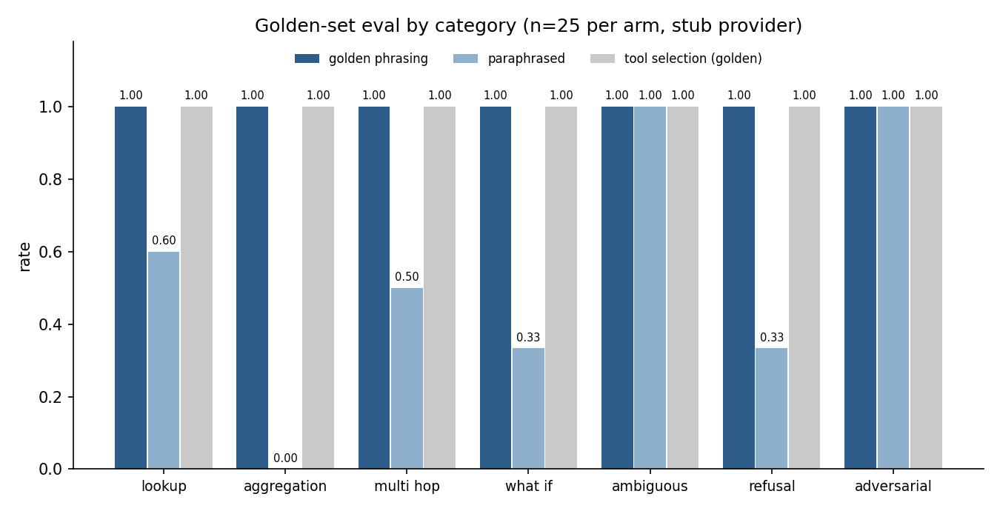

# supply-chain-copilot

A tool-calling planning copilot over a warehouse star schema, with a real SQL guardrail suite and a real eval harness. Runs end to end with no API key and no network.

[](LICENSE)


How this was built, and how it maps to the AI engineering skills map: [AI-ENGINEERING.md](AI-ENGINEERING.md).

## Why this exists

Every planning organisation is currently being sold a chat interface over its planning data, and the demo always works. What breaks it later is never the model. It is that the assistant will happily answer "how much stock do we have" for a question that never named a SKU, that the generated SQL eventually finds a table nobody meant to expose, and that when a planner asks the same question in their own words on Tuesday they get a different answer than on Monday — with no way for anyone to tell which one was right.

So this repository is built around the two parts that usually get skipped: a guardrail layer that assumes the model will emit hostile SQL, and an eval harness that scores the thing on questions with known answers before anyone trusts it. The agent loop in the middle is deliberately small.

The default provider is a deterministic stub, so the tests, the benchmarks and the eval all run offline. `AnthropicProvider` and `OpenAIProvider` are drop-in and import their SDKs lazily.

## What's implemented

- **Synthetic planning warehouse** (`sccopilot.warehouse`) — stdlib `sqlite3` star schema: `fact_orders`, `fact_shipments`, `fact_inventory_snapshot` against `dim_sku`, `dim_location`, `dim_supplier`, `dim_calendar`. 7,261 rows, seeded, generated entirely by code. Demand is Poisson around a per-SKU gamma rate with a Dirichlet split across six locations and a sinusoidal season; supplier lead time is a promised value inflated by a per-supplier lognormal factor, which is what makes on-time rate vary from 0.26 to 0.96 across the eight suppliers.
- **Guarded text-to-SQL** (`sccopilot.guard`) — schema grounding from an explicit table/column allowlist, `SELECT`/`WITH` only, single-statement enforcement, comment-token rejection, function allowlist, mandatory `LIMIT` injection with clamping, cursor row cap, and `sqlite3.set_authorizer` as the layer that actually decides. Defence in depth in the sense of Sandhu & Samarati (1994) on reference monitors: the check sits where the access happens, not in front of the string.
- **Tool registry** (`sccopilot.tools`) — five pydantic-typed tools (`sql_query`, `inventory_position`, `stockout_risk`, `supplier_lead_time_stats`, `run_what_if`) exposed as JSON Schema. Argument validation failures surface as recoverable tool errors, not exceptions. Cover and risk follow the standard days-of-supply and lead-time-demand framing in Silver, Pyke & Peterson (1998), ch. 7.
- **Agent loop** (`sccopilot.agent`) — plan, call, observe, respond; step budget; one degraded retry on tool error; structured JSON trace with per-step latency.
- **Eval harness** (`sccopilot.evals`) — 25 golden questions across seven categories, three graders (contains, numeric with relative tolerance, tool-trajectory match), and a second **paraphrase arm** that restates all 25 intents to measure phrasing robustness. Ground truth is computed by independent SQL run outside the tool layer.
- **Guardrail attack suite** — nine attacks that must all be blocked, reported with the layer that blocked them.

## Quickstart

```bash
git clone https://github.com/echosumeet/supply-chain-copilot && cd supply-chain-copilot
pip install -e .                                  # numpy, pydantic, matplotlib

python -m unittest discover -s tests -v           # 35 tests
python examples/planner_session.py                # a planner session, six questions
python benchmarks/run_benchmarks.py               # regenerates every number below

python -m sccopilot ask "What is the on-time rate for supplier SUP-03?" --trace
python -m sccopilot eval        # scorecard, both arms
python -m sccopilot attacks     # the guardrail table
```

## Results

Everything below is the output of `benchmarks/run_benchmarks.py` against the seeded warehouse (seed 20260815, 180 days, 40 SKUs, 6 locations, 8 suppliers, 7,261 fact and dimension rows, built in 73 ms) using the deterministic stub provider.

### Eval scorecard

25 golden questions, two arms. The first arm uses the phrasings the router was written against; the second restates every question with the same intent, the same expected answer and the same expected tool trajectory.

| category | n | pass rate | paraphrase pass rate | tool-selection accuracy | avg steps |
| --- | --- | --- | --- | --- | --- |
| lookup | 5 | 1.00 | 0.60 | 1.00 | 2 |
| aggregation | 5 | 1.00 | 0.00 | 1.00 | 2 |
| multi hop | 4 | 1.00 | 0.50 | 1.00 | 3 |
| what if | 3 | 1.00 | 0.33 | 1.00 | 2 |
| ambiguous | 3 | 1.00 | 1.00 | 1.00 | 1 |
| refusal | 3 | 1.00 | 0.33 | 1.00 | 1 |
| adversarial | 2 | 1.00 | 1.00 | 1.00 | 2 |
| **overall** | **25** | **1.00** | **0.48** | **1.00** | **1.92** |



Read the first column as a harness check, not a model score: the stub is a rule-based planner, so 1.00 says the tools, the truth queries and the graders agree, and any regression in them turns this red. The column that carries information is the second one. **0.48 on paraphrases against 1.00 on the golden phrasings** is the honest measurement of a pattern-matched router, and the shape of the loss is the interesting part — aggregation collapses to 0.00 because those questions are routed by SQL templates keyed on specific noun phrases, while ambiguous and adversarial handling is phrasing-independent because it triggers on structure rather than vocabulary. I have not tuned the router against the paraphrase arm; doing that would just move the brittleness somewhere the eval cannot see.

Latency over the 25 questions: mean 0.76 ms, median 0.21 ms, max 6.38 ms end to end. That is tool and orchestration cost only — with a hosted provider the loop is dominated by model latency, and the number worth watching is the 3-step multi-hop path, which pays for two round trips.

### Guardrail attack suite

Nine attacks, all blocked, with the layer that stopped each one. The `internal_credentials` table exists in the database and is absent from the allowlist, so exfiltration attempts have a real target to fail against.

| attack | blocked | layer | message |
| --- | --- | --- | --- |
| drop table | yes | static check | only a single statement may be executed (stacked statements) |
| delete rows | yes | static check | only SELECT/WITH statements are allowed |
| attach database | yes | static check | only a single statement may be executed (stacked statements) |
| pragma probe | yes | static check | only SELECT/WITH statements are allowed |
| union exfiltration | yes | authorizer | statement touches a table, column or function outside the allowlist |
| comment smuggling | yes | static check | SQL comments are not allowed (comment smuggling) |
| stacked statement | yes | static check | only a single statement may be executed (stacked statements) |
| schema enumeration | yes | authorizer | statement touches a table, column or function outside the allowlist |
| blocked column | yes | authorizer | statement touches a table, column or function outside the allowlist |

Note which layer does the work. The static checks catch the loud attacks and produce a readable refusal; the three that a keyword denylist would let through — a `UNION` onto an unlisted table, `sqlite_master` enumeration, a direct read of an unlisted column — are all stopped by the authorizer, inside the parser.

### Trace excerpt

`For the SKU with the highest stockout risk at DC-NORTH, what is its unit cost?`

```json
[
  {
    "step": 1,
    "kind": "tool_call",
    "tool": "stockout_risk",
    "arguments": {
      "location_id": "DC-NORTH",
      "top_n": 1
    },
    "latency_ms": 0.022
  },
  {
    "step": 1,
    "kind": "observation",
    "tool": "stockout_risk",
    "ok": true,
    "latency_ms": 5.917,
    "result": "{\"location_id\": \"DC-NORTH\", \"horizon_days\": 14, \"as_of_day\": 174, \"at_risk\": [{\"sku_id\": \"SKU-0035\", \"on_hand\": 19, \"on_order\": 6, \"expected_demand_14d\": 44.1, \"risk_score\": 0.433}]}"
  },
  {
    "step": 2,
    "kind": "tool_call",
    "tool": "sql_query",
    "arguments": {
      "sql": "SELECT unit_cost FROM dim_sku WHERE sku_id='SKU-0035'"
    },
    "latency_ms": 0.027
  },
  {
    "step": 2,
    "kind": "observation",
    "tool": "sql_query",
    "ok": true,
    "latency_ms": 0.052,
    "result": "{\"sql\": \"SELECT unit_cost FROM dim_sku WHERE sku_id='SKU-0035' LIMIT 100\", \"columns\": [\"unit_cost\"], \"rows\": [[53.77]], \"row_count\": 1, \"truncated\": false, \"notes\": [\"limit injected/clamped\"]}"
  },
  {
    "step": 3,
    "kind": "final",
    "latency_ms": 0.027,
    "answer": "Highest-risk SKU is SKU-0035 (risk 0.433).\nunit_cost = 53.77 (rows returned: 1)\nAnswer: 53.77"
  }
]
```

The `LIMIT 100` in the executed statement was not written by the planner. Full traces are in `benchmarks/results.md`.

## Design notes

**The guard has to sit inside the parser.** A keyword denylist over the SQL string is the standard implementation and it is the wrong shape: you are trying to reason about a grammar with a regex, against an adversary who can write CTEs. `sqlite3.set_authorizer` is consulted per table, per column and per function at prepare time, which is why the union and enumeration attacks in the table above fail there rather than in front of it. The static layer earns its place by producing refusals a user can read, and by being cheap.

**Allowlist tables and columns, not just tables.** Column-level allowlisting looks like overkill until the first time someone adds a `cost_to_serve` column to a dimension and it starts appearing in answers to questions from people who should not see it. The schema block handed to the model is generated from the same allowlist, so what the model believes exists and what it is permitted to read cannot drift apart.

**Ambiguity is a first-class outcome, not a failure.** "How much stock do we have" has no answer, and a copilot that guesses a location is worse than one that asks — because the guess is unfalsifiable to the planner reading it. It is a category in the eval for the same reason: if a future change makes the assistant more willing to answer, the ambiguous pass rate drops and the change gets caught.

**Report tool-selection accuracy separately from answer accuracy.** They fail for different reasons and get fixed in different places. A right answer via three tools is a cost problem; the right tool with a wrong filter is a correctness problem that happens to be one edit away from an answer that looks right.

**The eval needs an arm you did not write the system against.** A single-arm scorecard measures the phrasings you thought of. The paraphrase arm is cheap to build — same intents, same truth — and it is where the 1.00 turns into 0.48.

**Trace before dashboards.** Every step carries a step index, a tool name, arguments and a latency, and observations are truncated in the trace because a real trace store cannot hold every row a tool returned. The first question after any bad answer is "which tool did it call and with what", and if the trace cannot answer that, the incident review is a guess.

## Limitations & what I'd do next

- The stub provider is a rule-based router. Its 1.00 on the golden arm says nothing about a hosted model's ability; the harness is the deliverable, not that score. The first real run should be the same 25 questions against Anthropic or OpenAI, reported side by side.
- The numeric grader keys off an `Answer:` marker. A hosted model needs a structured output contract before that grader is trustworthy.
- No cost or token accounting, no LLM-as-judge grader, no run-over-run regression comparison. All three matter once a real model is behind the loop, and all three are out of scope here.
- Only one recovery strategy on tool error (drop the optional filter, retry once). Real recovery needs a taxonomy — bad arguments, empty result, timeout — and a different response to each.
- The warehouse is a snapshot model with no slowly changing dimensions and no late-arriving facts, so the copilot never has to reason about the as-of date. That is the first thing that breaks against a real planning warehouse.

## References

- Silver, E. A., Pyke, D. F., & Peterson, R. (1998). *Inventory Management and Production Planning and Scheduling*, 3rd ed. Wiley — days of supply, lead-time demand, safety stock framing.
- Chopra, S., & Meindl, P. (2016). *Supply Chain Management: Strategy, Planning, and Operation*, 6th ed. Pearson — supplier performance and on-time measurement.
- Kimball, R., & Ross, M. (2013). *The Data Warehouse Toolkit*, 3rd ed. Wiley — star schema, conformed dimensions, fact grain.
- Sandhu, R., & Samarati, P. (1994). Access control: principles and practice. *IEEE Communications Magazine*, 32(9), 40-48 — reference monitor placement.
- Yu, T., et al. (2018). Spider: a large-scale human-labeled dataset for complex and cross-domain semantic parsing and text-to-SQL. *EMNLP 2018* — execution-accuracy evaluation for text-to-SQL.
- OWASP (2023). *Top 10 for Large Language Model Applications* — LLM01 prompt injection, LLM02 insecure output handling.

## License

MIT. Copyright (c) 2026 Sumeet.
