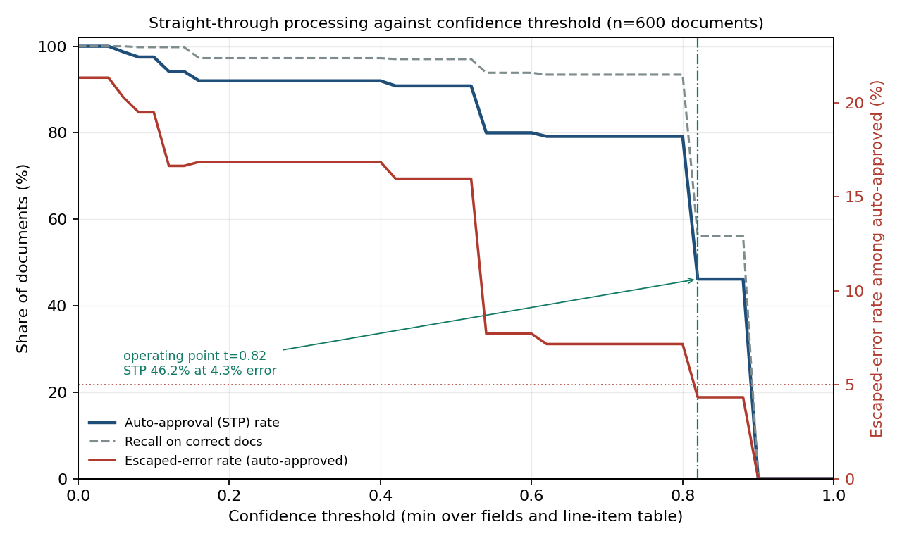

# tradedoc-intelligence

Trade document extraction, three-way reconciliation and a straight-through-processing
curve you can audit, because the repository generates its own ground truth.


How this was built, and how it maps to the AI Engineering skills map:
[`AI-ENGINEERING.md`](AI-ENGINEERING.md).

## Why this exists

Document automation in trade compliance is usually sold on field-level accuracy, and
field-level accuracy is the wrong number. A commercial invoice carries seven fields plus
a line-item table; at 98% per field it is fully correct about 79% of the time, and the
21% still has to be found by a human. The second failure, which costs more, is that each
document is checked in isolation: a packing list that is internally perfect and
disagrees with the invoice on one line quantity passes every single-document validation
and then stops the container at the border.

This repository measures the two things an operations owner actually buys — what share
of documents clear untouched at an agreed error budget, and what share of genuine
cross-document discrepancies get caught — on a corpus where every answer is known
because the code wrote both the documents and the truth.

## What's implemented

- **Generator** for commercial invoice, packing list and bill of lading from one
  shipment record: three layouts, eight vendors across eight countries, six currencies,
  all eleven Incoterms 2020 rules (ICC pub. 723E), three date conventions. Emits a text
  rendering, a `reportlab` PDF and ground-truth JSON per document.
- **Three independent noise mechanisms** — per-character OCR substitution, field
  omission, and real cross-document inconsistency — parameterised separately, because
  they fail and are fixed differently (`docs/design.md`).
- **pydantic schemas with working validators**: HS chapter/subheading structure (WCO
  Harmonized System nomenclature), Incoterms 2020 enum, ISO 4217, ISO 3166-1 alpha-2,
  UN/ECE Recommendation 20 unit normalisation, multi-format date parsing with an
  explicit day-first/month-first hint, ISO 6346 container-number format.
- **Hybrid extraction**: deterministic label/layout rules first, an LLM pass on the
  residual behind an `LLMProvider` protocol. The default `StubProvider` is offline and
  deterministic; `AnthropicProvider` and `OpenAIProvider` lazily import their SDK inside
  the call. Everything here — tests, benchmarks, figure — runs with no key and no
  network.
- **Per-field confidence** from extractor agreement plus validator outcomes, as a
  transparent additive rule rather than a fitted model.
- **Three-way reconciliation** on line quantities, gross weight, package count and
  invoice totals, with severity graded on relative deviation.
- **Confidence-threshold sweep** producing STP rate, precision and recall at each
  threshold, and the operating point at a fixed escaped-error budget.

## Quickstart

```bash
git clone https://github.com/echosumeet/tradedoc-intelligence
cd tradedoc-intelligence
pip install -e .

python -m unittest discover -s tests -v     # 40 tests
python examples/broker_intake.py            # one shipment, end to end
python benchmarks/run_benchmarks.py         # regenerates every number below

python -m tradedoc generate --outdir corpus --pdf   # a corpus with PDFs + truth JSON
python -m tradedoc evaluate                         # JSON summary
```

## Results

200 shipments = 600 documents, seed 7. Documents are generated from one ground-truth
record each, with per-character OCR substitution at 0.006, field omission at 0.07 per
printed field, and a genuine cross-document inconsistency seeded in 18% of shipments.
Full tables in [`benchmarks/results.md`](benchmarks/results.md).

**Field-level accuracy** (exact match; an omitted field is correct only if the extractor
also returns nothing):

| document type | macro field accuracy | weakest field |
|---|---|---|
| commercial invoice | 97.9% | `total_value` 95.5% |
| packing list | 98.6% | `doc_date` 96.0% |
| bill of lading | 98.0% | `doc_date` 93.0% |

**Document-level accuracy — every field and every line item correct — is 78.7%.** That
gap between 98% and 79% is the whole argument for measuring STP instead.

**The STP curve.** `error` is the share of auto-approved documents containing at least
one wrong field:

| threshold | STP rate | escaped error | precision | recall |
|---|---|---|---|---|
| 0.00 | 100.0% | 21.33% | 0.787 | 1.000 |
| 0.40 | 92.0% | 16.85% | 0.832 | 0.973 |
| 0.56 | 80.0% | 7.71% | 0.923 | 0.939 |
| 0.80 | 79.2% | 7.16% | 0.928 | 0.934 |
| 0.88 | 46.2% | 4.33% | 0.957 | 0.561 |

At a **5% escaped-error budget the operating point is t=0.82, clearing 46.2% of
documents untouched**. A 2% or 3% budget is **infeasible at any threshold** on this
corpus: the residual errors are OCR substitutions that leave a syntactically valid value
behind (`INV-O0004` for `INV-00004`, `MV Cora1lia` for `MV Corallia`), and no
confidence signal available inside a single document separates them. That is a real
finding, not a tuning failure — see Limitations.



**Three-way discrepancy detection**, scored against the seeded defects, counting only
`major` and `critical` alerts:

| discrepancy kind | seeded | detected | rate |
|---|---|---|---|
| gross weight mismatch | 8 | 8 | 100.0% |
| package count mismatch | 11 | 11 | 100.0% |
| invoice total mismatch | 4 | 3 | 75.0% |
| line quantity mismatch | 14 | 9 | 64.3% |

Overall precision 0.756, recall 0.838 (31 caught, 6 missed, 10 false alerts).

## Design notes

**The second pass earns its keep on the residual, not as a confirmation oracle.**
Asking the model to re-read every field the rules already resolved costs 7.33 calls per
document against 0.53 for residual-only, and moves the operating point by less than one
point of STP (46.7% → 45.8%). It reads the same corrupted glyphs the rules read, so it
agrees with the rules for the same wrong reason. Confirmation only pays where the two
passes have genuinely independent views of the page.

**Absence has to be a first-class answer.** Roughly 7% of fields here are simply not
printed, which is realistic. An extractor that returns its best guess for a blank field
is not 7% less accurate, it is actively dangerous, because the guess is plausible and
nobody reviews it. The stub provider does hallucinate on blank fields — the test suite
asserts the invariant that such a value can never carry rule-level confidence, so it can
never be auto-approved.

**Validators exist to make corruption loud.** The single highest-value line in the
codebase is `parse_amount` refusing a numeric field containing a letter. Stripping the
letter turns `1OO` into `1` and files a wrong quantity at full confidence; refusing
turns it into a low-confidence field that lands in review.

**Reconcile only what you could read.** Alerting on a table with a rejected cell
produces an alert about the OCR, dressed as an alert about the shipment. Gating
reconciliation on table confidence moved discrepancy precision from 0.37 to 0.76 for
about eleven points of recall. In a live queue that trade is not close: analysts stop
opening a queue that is two-thirds noise, and then the real 24% goes unread too.

**What I'd instrument in production**: escaped-error rate by field and by vendor
template (drift shows up per-template long before it shows up in the aggregate), the
share of holds a reviewer overturns without changing anything (that is your threshold
telling you it is too tight), and time-to-clear on held documents rather than hold rate.

## Limitations and what I'd do next

- The irreducible errors are single-document-invisible: a corrupted value that still
  validates. The fix is not a better threshold, it is another source — the same buyer,
  vessel and port appear on all three documents, so cross-document *field* voting (not
  just quantity reconciliation) should recover most of them. That is the first thing
  I would add.
- Extraction is measured on the text rendering, not on OCR of the PDF. The PDFs exist so
  a real OCR/layout stack can be dropped in front; the character-corruption model stands
  in for it and is calibrated to nothing.
- The corpus is synthetic and my own generator's idea of a trade document. Layout
  diversity is three variants; real intake sees hundreds, and rule coverage degrades
  much faster than this suggests.
- No certificate of origin, customs declaration, duty/landed-cost estimation, or review
  queue implementation. Confidence weights were tuned once against the calibration
  corpus and frozen; they are constants in `pipeline.py`, not learned.
- Discrepancy severity thresholds (0.5% tolerance, 2% major, 10% critical) are
  defensible defaults, not derived from cost. With a real cost of a held container and a
  real cost of a customs penalty, they should be an expected-cost decision.

## References

- International Chamber of Commerce. *Incoterms 2020* (ICC publication 723E).
- World Customs Organization. *Harmonized Commodity Description and Coding System*
  nomenclature, chapter and subheading structure.
- ISO 4217 currency codes; ISO 3166-1 alpha-2 country codes; ISO 6346 freight container
  coding and marking.
- UN/ECE Recommendation 20, *Codes for Units of Measure Used in International Trade*.
- Chopra, S. and Meindl, P. *Supply Chain Management: Strategy, Planning, and
  Operation*, chapters on global supply chain coordination and information flows.
- Vapnik, V. and Vashist, A. (2009). "A new learning paradigm: learning using privileged
  information." *Neural Networks* 22(5–6) — the framing for using generator-side truth
  at evaluation time only.

## License

MIT. Copyright (c) 2026 Sumeet.
