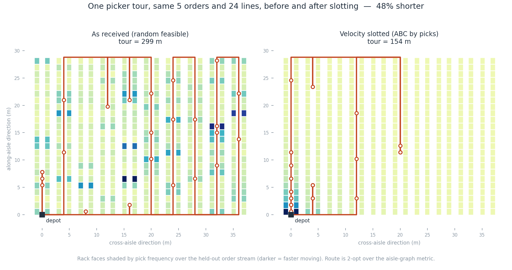

# warehouse-slotting

Slotting and pick-path optimisation for a manual forward pick area, measured on a real aisle-graph travel metric against an exact routing reference.

[](LICENSE)
[](pyproject.toml)
[](.github/workflows/ci.yml)

## Why this exists

Picker travel is 50-60% of order-picking labour, and slotting is the cheapest lever on it — no capex, one weekend of relabelling. The failure mode is not that sites do not know this. It is that the slotting study is built on the wrong distance, validated on the demand it was fitted to, and handed to a WMS whose pick-path logic was tuned for the old layout and never revisited.

All three are quiet. A Euclidean distance matrix will slot two co-ordered SKUs facing each other across a rack wall and score it as a win. Fitting and scoring ABC on the same twelve weeks reports the fit rather than the benefit. And a warehouse that re-slots without re-examining its routing heuristic can move S-shape from 17% above optimal to 49% above optimal — the slotting gain is real and the routing gives a chunk of it straight back.

This library does all three properly and reports what each is worth.

## What's implemented

**Geometry and metric**
- Block-layout warehouse (aisles x bays x levels, configurable cross aisles) with the exact shortest-path metric over the corridor graph. Validated pair-by-pair against Dijkstra on an explicit `networkx` graph.
- Ergonomic cost by pick height and case weight, converted to metre-equivalents so travel and golden-zone placement share one objective (NIOSH-style height/weight penalty; golden-zone practice per Bartholdi & Hackman, *Warehouse & Distribution Science*).

**Slotting**
- ABC / velocity slotting by pick frequency and by cube movement.
- Cube-per-order index (Heskett 1963), the correct rank when storage cube is scarce.
- Class-based zoning with random placement inside class (Hausman, Schwarz & Graves 1976).
- Affinity slotting: co-occurrence graph, greedy and spectral clustering, clusters laid out by region growing.
- Steepest descent and simulated annealing over a calibrated surrogate objective, under hard constraints (weight-by-level, cube fit, hazmat separation and floor-level restriction).

**Routing**
- S-shape, return, midpoint, largest-gap (Hall 1993; Petersen 1997).
- Nearest neighbour and 2-opt over the aisle metric.
- **Exact references:** the Ratliff & Rosenthal (1983) aisle-by-aisle dynamic program, polynomial in the number of aisles, plus Held-Karp for cross-checking. Every heuristic is reported as a gap against these.

**Batching**
- Seed batching and Clarke-Wright savings batching under cart limits (orders / lines / cube).

## Quickstart

```bash
git clone https://github.com/echosumeet/warehouse-slotting
cd warehouse-slotting
python -m pip install -e ".[figures]"

make test        # 36 unittest cases, no test dependencies
make bench       # regenerates benchmarks/results.md (~12 s)
make example     # end-to-end walkthrough
make figures     # regenerates docs/pick_path.png
```

Or from Python:

```python
from slotting import build_instance, random_assignment, velocity_slotting, evaluate_travel

inst = build_instance(seed=7)                 # warehouse + catalogue + order stream
base = random_assignment(inst.constraints, seed=0)
slot = velocity_slotting(inst.constraints, metric="picks", pick_rate=inst.fit_rate)

before = evaluate_travel(inst, base, policies=("two_opt",))["two_opt"]
after = evaluate_travel(inst, slot, policies=("two_opt",))["two_opt"]
print(f"{1 - after / before:.1%} less travel")   # 52.9%
```

The CLI covers the same ground:

```bash
python -m slotting describe
python -m slotting slot --policy velocity --router two_opt
python -m slotting route --order 3          # one order, every heuristic, vs exact
```

## Results

Full output in [`benchmarks/results.md`](benchmarks/results.md), regenerated by `benchmarks/run_benchmarks.py` in 11.7 s.

**The instance.** 10 aisles x 24 bays x 4 levels = 1,920 pick faces over a 28.8 m aisle run; 900 SKUs; 4,000 orders. Demand is Zipf (exponent 0.92) over SKUs, so the fastest 20% carry 66.6% of picks. Basket size is overdispersed relative to Poisson at 3.50 lines per order, 24.3% single-line. 75% of orders carry a family theme, giving a measured within-family co-occurrence lift of 5.07x over an independence null that corrects for basket-size dispersion. 63 SKUs are hazmat and restricted to floor level. Slotting sees the first 2,400 orders; every number below is scored on the held-out 1,600.

**Travel by slotting policy** — total km over the held-out stream, one tour per order:

| Slotting policy | S-shape | Return | Midpoint | Largest gap | 2-opt | vs baseline |
| --- | ---: | ---: | ---: | ---: | ---: | ---: |
| as-received (random feasible) | 217.2 | 223.9 | 189.7 | 192.7 | 181.4 | baseline |
| ABC by pick frequency | 120.4 | 89.2 | 91.9 | 112.8 | **85.5** | **-52.9%** |
| COI (Heskett 1963) | 120.1 | 89.5 | 91.7 | 113.2 | 85.7 | -52.7% |
| ABC + steepest descent | 119.8 | 90.3 | 93.6 | 113.9 | 86.3 | -52.4% |
| affinity (greedy clusters) | 119.6 | 91.7 | 94.8 | 114.3 | 88.1 | -51.4% |
| ABC by cube movement | 125.4 | 97.2 | 99.5 | 119.5 | 92.6 | -48.9% |
| ABC + simulated annealing | 130.2 | 97.7 | 99.8 | 120.8 | 93.1 | -48.7% |
| class-based A/B/C zones | 137.7 | 112.5 | 115.1 | 130.4 | 107.2 | -40.9% |
| affinity (spectral clusters) | 167.3 | 159.8 | 151.7 | 158.2 | 140.9 | -22.3% |

That is 113.4 m per order down to 53.4 m per order. In-sample the same slotting reads 49.6 m per order, so **the benefit decays 7.7% out of sample** — that decay is the honest cost of demand drift between re-slots, and it is what gets hidden by studies that score on the fitting period.

**Routing optimality gap** against the exact aisle DP, tour by tour, under the best slotting:

| Routing heuristic | Mean gap | p90 gap | Max gap | Same, unslotted |
| --- | ---: | ---: | ---: | ---: |
| 2-opt | **0.08%** | 0.00% | 6.90% | 0.18% |
| Return | 3.26% | 8.58% | 80.49% | 19.72% |
| Midpoint | 4.33% | 20.58% | 55.93% | 4.59% |
| Largest gap | 42.21% | 105.41% | 530.77% | 6.82% |
| S-shape | 48.71% | 115.38% | 530.77% | 16.56% |

**Read the last column against the first.** Slotting inverts the ranking. In an unslotted warehouse the aisle-traversing heuristics are reasonable and return routing is the worst thing you can do, because picks are spread the length of every aisle. After slotting, picks collapse into the first few bays, return routing becomes near-optimal and S-shape triples its gap — it walks 28.8 m of aisle to serve three bays at the mouth. A site that re-slots on a WMS pinned to S-shape converts a large part of its slotting gain into wasted metres.

**Batching**, under the best slotting, cart limits 6 orders / 24 lines / 0.75 m³:

| Batching policy | Tours | Total km | m / order | Aisles / tour |
| --- | ---: | ---: | ---: | ---: |
| single order | 1,600 | 120.4 | 75.2 | 2.2 |
| seed batching | 356 | 51.7 | 32.3 | 4.0 |
| savings batching | 379 | 40.3 | 25.2 | 3.1 |
| savings + largest gap | 379 | 39.5 | 24.7 | 3.1 |



Same five orders and 24 lines, before and after slotting: 299 m to 154 m, 48.5% shorter. Rack faces are shaded by pick frequency over the held-out stream, so the mechanism is visible — slotting pulls the dark faces to the depot end and the tour collapses onto them.

## Design notes

Longer version in [`docs/design.md`](docs/design.md). How this repository was built, and how it maps to the AI Engineering skills map, is in [`AI-ENGINEERING.md`](AI-ENGINEERING.md).

**The metric is the whole problem.** Euclidean distance between pallet positions is wrong by a factor that is not constant: two faces across a rack are 2.5 m apart in the plane and sixty metres apart for a picker. Every downstream number inherits that error, and it inherits it asymmetrically — affinity clustering is hurt worst, because "put these two together" is precisely the decision the plane gets wrong. The closed form here is checked against Dijkstra on an explicit corridor graph for every pair of locations, in one-block and two-block layouts, and then used everywhere because it is orders of magnitude faster and the search calls it millions of times.

**Vertical is not horizontal.** A picker does not walk up the rack. Level 3 costs seconds and shoulder load, not metres, so it is priced in `slotting.ergonomics` and converted to metre-equivalents at a stated walking speed. This is what makes the local-search result readable rather than embarrassing: steepest descent lands 1.0% *worse* on travel than plain ABC while lifting golden-zone share from 30.8% to 36.7%. It is not failing to optimise — it is buying ergonomics with travel, at a rate the objective was told to accept. If you only measure metres you will conclude the search is broken, ship plain ABC, and find out about the trade from your injury rate instead.

**Calibrate the surrogate at the margin.** Local search cannot call a router in its inner loop, so it optimises a linear-plus-quadratic surrogate. Fitting those weights on *levels* of travel gives a well-fitting, useless model: what a swap decision needs is the marginal rate. `slotting.calibration` fits differentially around a reference assignment and reports R² 0.989 on move deltas. It also prices affinity at exactly 0.000 on this instance — at 3.5 lines per order there is not enough co-occurrence mass for pairing to beat proximity-to-depot, which is why greedy affinity slotting lands mid-table and spectral clustering lands last. A tool that hard-codes a positive affinity weight because affinity is fashionable will slot to it anyway.

**Hold routing to an exact answer.** Routing is the one part of this where optimal is cheap, so there is no excuse for reporting a heuristic without its gap. The DP and Held-Karp are cross-asserted to 1e-6 on every instance small enough for both, so the gap table does not rest on one implementation being right. This is also the cheapest real-world diagnostic in the repo: if your WMS's routes are 40% above the DP on your own pick data, that is a configuration finding, available before anyone touches a rack.

**What I would measure on site.** Metres are a modelling output, not an observation. What is observable is time between scans, and the mapping from metres to seconds is site-specific — congestion, cart type, aisle width, whether pickers cut through gaps that the graph says do not exist. I would validate the metric against scan timestamps before quoting any saving in hours, and I would expect the affinity term to look better on a site with larger baskets than this generator produces.

## Limitations and what I'd do next

- **Single picker, no congestion.** Tours are independent. Real aisles block, and blocking rises with exactly the concentration that slotting creates — the 52.9% is an upper bound and the gap widens with picker density. A discrete-event layer over the tours is the obvious next piece.
- **Static slotting, one horizon.** No re-slot scheduling, no relabelling cost. The out-of-sample decay (7.7%) is measured but not optimised against; the real decision is re-slot cadence versus move cost, which needs a cost per relocation this model does not carry.
- **Orders bigger than a cart are not split.** Three orders in the headline stream exceed 0.75 m³ on their own and are picked as oversize singletons rather than split across trips, which is what a WMS would do.
- **Single-block heuristics are single-block.** S-shape, midpoint and largest-gap raise a clear error on multi-block layouts rather than silently returning a wrong number; the Roodbergen & de Koster (2001) multi-block extension is not implemented. 2-opt and nearest-neighbour work on any geometry.
- **Demand is stationary within the stream.** Drift is present only through sampling noise between the fit and score periods, so 7.7% is a floor. Seasonal or promotional shift would be worse, and that is the case where re-slot cadence actually matters.
- **No replenishment.** Slotting a fast mover into a small face means more replenishment trips. This model prices the pick and ignores the refill, which is why COI is included as an alternative rank.

## References

- Ratliff, H.D. & Rosenthal, A.S. (1983). Order-picking in a rectangular warehouse: a solvable case of the travelling salesman problem. *Operations Research* 31(3), 507-521.
- Hall, R.W. (1993). Distance approximations for routing manual pickers in a warehouse. *IIE Transactions* 25(4), 76-87.
- Petersen, C.G. (1997). An evaluation of order picking routeing policies. *International Journal of Operations & Production Management* 17(11), 1098-1111.
- Roodbergen, K.J. & de Koster, R. (2001). Routing methods for warehouses with multiple cross aisles. *International Journal of Production Research* 39(9), 1865-1883.
- Heskett, J.L. (1963). Cube-per-order index: a key to warehouse stock location. *Transportation and Distribution Management* 3, 27-31.
- Hausman, W.H., Schwarz, L.B. & Graves, S.C. (1976). Optimal storage assignment in automatic warehousing systems. *Management Science* 22(6), 629-638.
- de Koster, R., Le-Duc, T. & Roodbergen, K.J. (2007). Design and control of warehouse order picking: a literature review. *European Journal of Operational Research* 182(2), 481-501.
- Clarke, G. & Wright, J.W. (1964). Scheduling of vehicles from a central depot to a number of delivery points. *Operations Research* 12(4), 568-581.
- Held, M. & Karp, R.M. (1962). A dynamic programming approach to sequencing problems. *Journal of the SIAM* 10(1), 196-210.
- Bartholdi, J.J. & Hackman, S.T. *Warehouse & Distribution Science*. Georgia Tech, freely available.

## License

MIT — see [LICENSE](LICENSE). Copyright (c) 2026 Sumeet.
